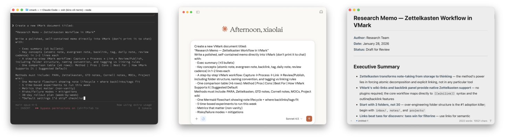

# VMark

**The Markdown Editor That Gets It Right**

Free. Smart. Beautiful. Yours.

<p align="center">
  
</p>

VMark is a modern, local-first Markdown editor designed for the AI era. It combines the simplicity of rich text editing with the power of source mode — clean when you need focus, powerful when you need control.

**[Download](https://github.com/xiaolai/vmark/releases)** · **[Documentation](https://vmark.app/guide/)** · **[Features](https://vmark.app/guide/features)**

---

## Why VMark?

### 🤖 AI-Native

Built to work seamlessly with AI assistants. Claude, Codex, and Gemini can read your documents, suggest edits, and write content directly — no plugins required.

- One-click setup for Claude Desktop, Claude Code, Codex CLI, Gemini CLI
- AI suggestions appear inline for your review
- Accept or reject changes with a keystroke

### 🌏 CJK Done Right

Finally, a Markdown editor that understands Chinese, Japanese, and Korean text. Smart spacing between CJK and Latin characters, proper punctuation handling, and 19+ formatting rules — all built in.

- Automatic CJK-Latin spacing
- Fullwidth punctuation conversion
- Corner bracket quotes for CJK
- One shortcut to fix everything: `Alt + Cmd + Shift + F`

### ✍️ Two Modes, Zero Friction

Switch instantly between rich text (WYSIWYG) and source mode. See your formatting rendered beautifully, or dive into the Markdown source when you need precision.

- Rich text mode powered by Tiptap/ProseMirror
- Source mode powered by CodeMirror 6
- Toggle with `Cmd + /`

### 🎨 Beautifully Designed

Five hand-crafted themes designed for extended writing sessions. Typography that respects your fonts. An interface that stays out of your way.

- **White** — Clean and minimal
- **Paper** — Warm and gentle
- **Mint** — Fresh and focused
- **Sepia** — Classic reading feel
- **Night** — Easy on the eyes

### 🔒 Local-First, Always

Your documents stay on your machine. No cloud services, no accounts, no tracking. VMark works entirely offline.

---

## Features

| Category | What You Get |
|----------|--------------|
| **Editing** | Rich text, source mode, focus mode, typewriter mode |
| **Formatting** | Headings, lists, tables, code blocks, blockquotes |
| **Advanced** | Math equations (LaTeX), Mermaid diagrams, wiki links |
| **AI Integration** | MCP support for Claude, Codex, Gemini |
| **CJK** | 19+ formatting rules for Chinese, Japanese, Korean |
| **Customization** | 165 keyboard shortcuts, 5 themes, font controls |
| **Export** | HTML, PDF, copy as HTML |

---

## Installation

### macOS (Recommended)

**Homebrew:**

```bash
brew install xiaolai/tap/vmark
```

**Manual Download:**

Download the `.dmg` from the [Releases page](https://github.com/xiaolai/vmark/releases).
- Apple Silicon (M1/M2/M3): `VMark_x.x.x_aarch64.dmg`
- Intel: `VMark_x.x.x_x64.dmg`

### Windows & Linux

Pre-built binaries are available on the [Releases page](https://github.com/xiaolai/vmark/releases). Active development is focused on macOS; Windows and Linux builds are provided as-is.

---

## AI Integration

VMark speaks [MCP](https://modelcontextprotocol.io/) (Model Context Protocol) natively. Connect your favorite AI assistant in one click:

1. Open **Settings → Integrations**
2. Enable MCP Server
3. Click **Install** for your AI assistant
4. Restart the AI assistant

That's it. Your AI can now read, edit, and write to your VMark documents.

**Supported assistants:**
- Claude Desktop
- Claude Code
- Codex CLI
- Gemini CLI

For Claude Code users, install the [vmark-mcp skill](https://vmark.app/guide/claude-code-skill) for enhanced writing workflows.

---

## Keyboard Shortcuts

VMark has 165 customizable shortcuts. Here are the essentials:

| Shortcut | Action |
|----------|--------|
| `Cmd + /` | Toggle Rich Text / Source Mode |
| `F8` | Toggle Focus Mode |
| `F9` | Toggle Typewriter Mode |
| `Cmd + S` | Save |
| `Cmd + Shift + V` | Paste as Plain Text |
| `Alt + Cmd + Shift + F` | Format CJK Text |

See the full list in **Settings → Keyboard Shortcuts** or the [documentation](https://vmark.app/guide/shortcuts).

---

## Documentation

- **[Getting Started](https://vmark.app/guide/)** — First steps with VMark
- **[Features](https://vmark.app/guide/features)** — Complete feature overview
- **[Keyboard Shortcuts](https://vmark.app/guide/shortcuts)** — All 165 shortcuts
- **[CJK Formatting](https://vmark.app/guide/cjk-formatting)** — CJK text handling
- **[MCP Setup](https://vmark.app/guide/mcp-setup)** — AI integration guide
- **[MCP Tools](https://vmark.app/guide/mcp-tools)** — Complete MCP reference

---

## Building from Source

For developers who want to contribute or build VMark locally.

### Prerequisites

- [Node.js](https://nodejs.org/) 18+
- [pnpm](https://pnpm.io/) 8+
- [Rust](https://www.rust-lang.org/tools/install) (latest stable)
- [Tauri Prerequisites](https://v2.tauri.app/start/prerequisites/)

### Quick Start

```bash
# Clone
git clone https://github.com/xiaolai/vmark.git
cd vmark

# Install dependencies
pnpm install

# Run in development mode
pnpm tauri dev

# Build for production
pnpm tauri build
```

### Development Commands

| Command | Description |
|---------|-------------|
| `pnpm tauri dev` | Start development mode |
| `pnpm test` | Run tests |
| `pnpm lint` | Run linter |
| `pnpm check:all` | Lint + test + build |

### Project Structure

```
vmark/
├── src/                    # React frontend
├── src-tauri/              # Rust backend (Tauri)
├── vmark-mcp-server/       # MCP server
├── website/                # Documentation (VitePress)
└── plugins/                # Claude Code skills
```

### Tech Stack

- **Framework:** Tauri v2 (Rust backend)
- **Frontend:** React 19, TypeScript, Zustand
- **Rich Editor:** Tiptap (ProseMirror)
- **Source Editor:** CodeMirror 6
- **Styling:** Tailwind CSS v4

---

## License

Private - All rights reserved.

---

<p align="center">
  <b>Questions?</b> Open an <a href="https://github.com/xiaolai/vmark/issues">issue</a> · <b>Updates?</b> Watch this repo
</p>
