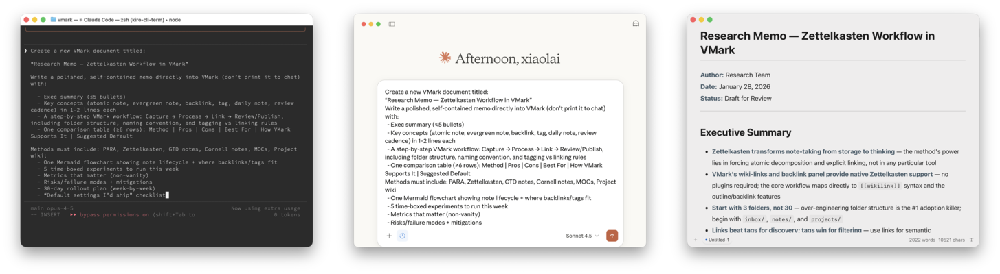

# VMark

**The Plain-Text Workspace Where Humans and AI Collaborate**

Free. Local-first. Format-aware.

<p align="center">
  
</p>

VMark is the plain-text workspace where humans and AI collaborate. Both parties read and write the same artifacts — Markdown, YAML, JSON, TOML, Mermaid, SVG, HTML, code — directly, with no translation layer. When the file is a known artifact (GitHub Actions workflow, `Cargo.toml`, `package.json`, `pyproject.toml`), VMark renders the *right* view, not a generic JSON tree.

**[Download](https://github.com/xiaolai/vmark/releases)** · **[Documentation](https://vmark.app/guide/)** · **[Formats](https://vmark.app/guide/formats)** · **[Features](https://vmark.app/guide/features)**

---

## Highlights

- **Multi-Format** — Markdown (WYSIWYG + source), JSON / JSONL, YAML, TOML, Mermaid, SVG, HTML (sandboxed), plain text. Code files (.ts, .py, .rs, .go, .css, …) open as syntax-highlighted viewers; toggle to edit in place or open in your `$EDITOR`.
- **Schema-Aware Previews** — `.github/workflows/ci.yml` opens with a workflow-graph view. `Cargo.toml`, `package.json`, and `pyproject.toml` open with a dependency-tree view. Generic JSON / YAML / TOML get a navigable tree.
- **AI-Native** — MCP integration for Claude Desktop, Claude Code, Codex CLI, Gemini CLI. AI Genies for inline writing assistance. Both you and the AI work on the same plain-text files.
- **Three Markdown Modes** — WYSIWYG (Tiptap/ProseMirror), Source Peek (`F5`), Source Mode (`F6`, CodeMirror 6)
- **Multi-Cursor** — `Mod + D` to select next match, `Alt + Click` to add cursors, `Mod + Alt + ↑↓` for vertical cursors
- **Tab Escape** — Auto-pair brackets/quotes, press Tab to jump past closing characters
- **CJK Done Right** — 20+ formatting rules for Chinese, Japanese, Korean text
- **10 Languages** — English · 简体中文 · 繁體中文 · 日本語 · 한국어 · Deutsch · Español · Français · Italiano · Português (Brasil). Auto-detected on first launch.
- **6 Themes** — White, Paper, Mint, Sepia, Night, Solarized
- **Local-First** — No cloud, no accounts, no analytics. Documents stay on your machine.
- **122 Shortcuts** — All customizable in Settings

See the full feature list at **[vmark.app/guide/features](https://vmark.app/guide/features)**.

---

## Install

**macOS (Homebrew):**

```bash
brew install xiaolai/tap/vmark
```

**Manual:** Download from the [Releases page](https://github.com/xiaolai/vmark/releases).
- Apple Silicon: `VMark_x.x.x_aarch64.dmg`
- Intel: `VMark_x.x.x_x64.dmg`

**Windows & Linux:** Pre-built binaries on the [Releases page](https://github.com/xiaolai/vmark/releases). macOS is the primary platform; other builds are best-effort.

---

## AI Integration

VMark speaks [MCP](https://modelcontextprotocol.io/) natively. **Settings → Integrations → Install** — one click per assistant.

Supported: Claude Desktop, Claude Code, Codex CLI, Gemini CLI.

See the **[MCP Setup Guide](https://vmark.app/guide/mcp-setup)**.

---

## Contributing: Issues Only, No PRs

VMark is **vibe-coded** — written entirely by AI under human supervision. We welcome **issues** (bug reports, feature requests) but cannot safely merge external PRs.

When you file an issue, AI fixes it with full context of the project's conventions, test suite, and architecture.

- **[Bug Report](.github/ISSUE_TEMPLATE/bug_report.yml)** · **[Feature Request](.github/ISSUE_TEMPLATE/feature_request.yml)**
- Read more: **[Why Issues, Not PRs](https://vmark.app/guide/users-as-developers/why-issues-not-prs)**

---

## Building from Source

**Prerequisites:** [Node.js](https://nodejs.org/) 20+, [pnpm](https://pnpm.io/) 10+, [Rust](https://www.rust-lang.org/tools/install) (stable), [Tauri v2 prerequisites](https://v2.tauri.app/start/prerequisites/)

```bash
git clone https://github.com/xiaolai/vmark.git
cd vmark
pnpm install
pnpm tauri dev        # Development
pnpm tauri build      # Production
pnpm check:all        # Lint + test + build
```

**Tech Stack:** Tauri v2 (Rust), React 19, TypeScript, Zustand v5, Tiptap, CodeMirror 6, Tailwind CSS v4

**AI-Assisted Development:** The repo ships with full configuration for Claude Code, Codex CLI, and Gemini CLI. See `AGENTS.md` for conventions and `.claude/` for rules, skills, and subagents.

---

## Star History

<!-- Hosted by star-history.com again, via a SEALED TOKEN. On 2026-06-30 GitHub
     restricted the stargazers API to a repo's own admins and collaborators, so
     api.star-history.com served a "restricted" notice for every repo and this
     block had to be self-hosted. The sealed_token below re-authorises it: it
     wraps a fine-grained GitHub token so star-history.com can read this repo's
     star data on our behalf.

     Two consequences worth knowing when this chart breaks:
       - the sealed token is a bearer capability and is PUBLIC here by design;
         it is only as narrowly scoped as the fine-grained PAT behind it, so
         that PAT should be read-only on public repo metadata;
       - fine-grained PATs EXPIRE. When this silently reverts to a "restricted"
         notice, the token has lapsed — reissue it at star-history.com.

     The <picture> carries exactly two entries, and the pairing is not
     cosmetic: the chart's background is OPAQUE (#fff light, #0d1117 dark), so
     serving the light SVG to a dark reader puts a white slab with black text in
     a dark README. Hence a dark <source> plus the light  as the fallback.
     A third `prefers-color-scheme: light` <source> was dropped because its URL
     was byte-identical to that  — that one really was redundant.

     There is NO fallback any more. The self-hosted generator that carried this
     chart through the outage (scripts/gen-star-history.mjs, its workflow, its
     tests, a subsetted font and the roughjs dependency) was deleted with this
     change rather than left running weekly for an asset nothing reads. If the
     endpoint goes dark again, it is in the history — `git log -- scripts/gen-star-history.mjs`. -->
<a href="https://www.star-history.com/?repos=vmark%2Fvmark%2Cxiaolai%2Fvmark&type=date&legend=top-left">
 <picture>
   <source media="(prefers-color-scheme: dark)" srcset="https://api.star-history.com/chart?repos=vmark/vmark%2Cxiaolai/vmark&type=date&theme=dark&legend=top-left&sealed_token=qzdaDwLsJGl7o5BrAqxdidzzZ9Lssj-5DZ7-xtI-ZHgWG62bS-F8X29gUh02TQSxHD0eypMRp182O6QuTgb7WUs6JjSUsZi7ILMKUi58RpjlMyDlkDA0w3Y9cvv_Xvr62WDFWLrR1Tbr2G-8d_UbtTheGN7ZQ07OUF8BIZBzpwu7eukr-OrsMSoxteZD" />
   
 </picture>
</a>

---

## License

[ISC License](LICENSE) — free to use, copy, modify, and distribute. See the [license page](https://vmark.app/guide/license) for details.

---

<p align="center">
  <b>Questions?</b> Open an <a href="https://github.com/xiaolai/vmark/issues">issue</a> · <b>Updates?</b> Watch this repo
</p>
