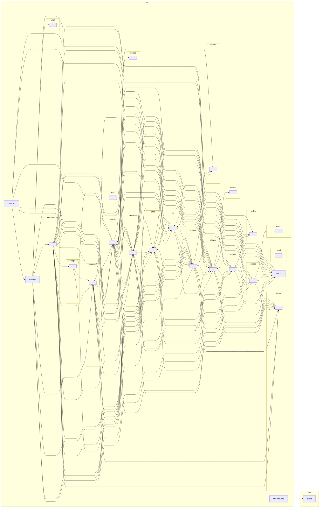

# VMark architecture — dependency graph (generated)

Computed from the real import graph by `dependency-cruiser`, collapsed to
`src/<top-level>` (node_modules, tests, and benches excluded). The COMPUTED
counterpart to the hand-authored `architecture.md` C4 map — when they disagree,
**this is the ground truth**. Regenerate with `pnpm arch:graph`; do not hand-edit.

