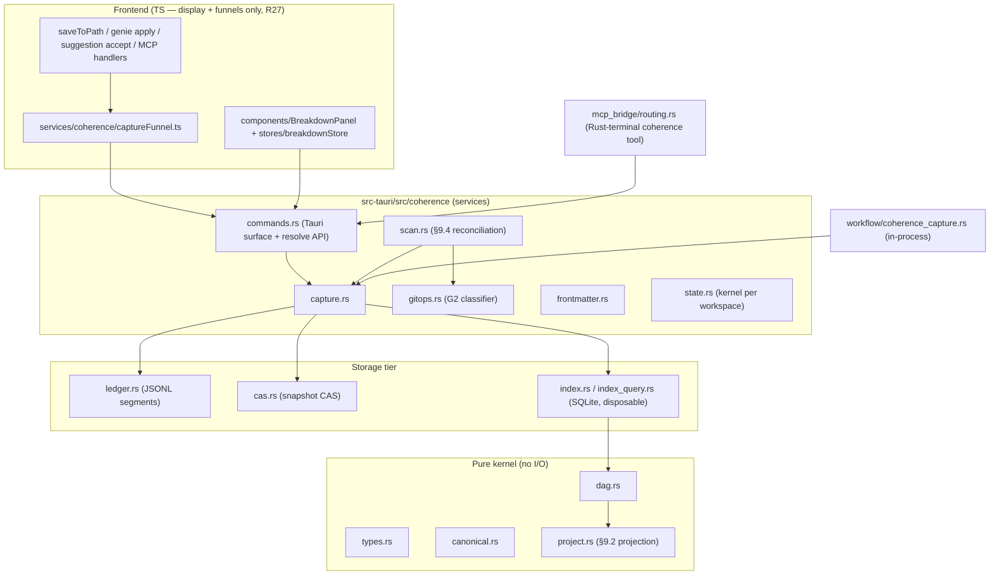

---
vmark:
  id: 019f758c-54bc-74a0-95ce-4e70da185ef4
---
# Coherence Layer — Implementation Architecture (Phase 1)

- **Contract:** `dev-docs/specs/coherence-format-v0.md` (on-disk format —
  the public interface); design rationale in
  `dev-docs/coherence-layer-paper.md`; plan
  `dev-docs/plans/20260718-coherence-layer.md`.
- **Status:** Phase 1 implementation (kernel + capture funnels +
  breakdown view + read-only MCP).

## Module map (ADR-C4)

Layering rules: `types`/`canonical`/`dag`/`project` do no I/O and are the
only home of staleness semantics (the SQLite index loads its tables into
a `RevisionDag` and calls `project_edge` — no SQL re-implementation that
could drift). TypeScript implements no kernel semantics (R27): the
frontend funnels report writes and render read models.

## Write path (capture)

1. A funnel site completes its write (or buffer apply), then calls
   `coherence_capture` with the **exact content** (never re-read from
   disk) plus its input set and agent identity.
2. The kernel reuses or assigns frontmatter identity (path-registry reuse
   prevents id churn from identity-less editor buffers). For live-buffer AI
   applies, `rewrite_identity: false` leaves disk content untouched; a later
   disk capture persists the registered identity, so the live buffer does not receive a frontmatter-only rewrite.
3. Snapshot CAS write → ledger append (fsync) → index apply. A crash
   between content write and capture is healed by scan reconciliation —
   the same mechanism as external edits.

Funnel classification (G1): editor saves are `human/exact`; genie applies
and suggestion accepts are `model/exact` (downgraded to `inferred` when
the buffer was dirty before the apply); MCP writes are `model/inferred`
with the session-observed read set; workflow `save-file` steps are
`model/exact` with transitively traced `read-file` inputs; everything
else is observed-external (`unknown`) on scan.

## Known Phase 1 characteristics (deliberate)

- **Buffer identity lag:** editors never see the `vmark:` block in-session
  after first capture; the kernel re-inserts the registered id on each
  save rewrite. Identity-masked hashing makes this invisible to staleness.
- **Tracked-ledger rewind:** checking out an old git commit rewinds the
  (tracked) ledger with the rest of the tree; union merges heal it across
  branches. Scan-level navigation classification keeps phantom revisions
  out either way.
- **Deletion is index-state, not history:** a deleted file marks its
  object absent (breakdown hides it); restoring the file revives it.
  Deletion-as-transformation is deferred to the retention design (O3).
- **Breakdown = scan + project:** `coherence_breakdown` reconciles before
  projecting (pull model, R15) — its ledger writes are limited to honest
  reconciliation records.

## Test topology

Every module has a sibling `*.test.rs` (`#[path]` include); golden hash
vectors are shared with the G1 capture probe
(`dev-docs/grills/coherence/probes/g1-capture.mjs`) so the JS and Rust
canonicalization can never drift silently. Frontend funnels and the
breakdown view are vitest-covered; the MCP tool has sidecar + Rust
routing tests. The R16 disposable-index property and the I5 append-only
surface are locked by dedicated tests
(`index.test.rs::delete_index_rescan_identical`,
`ledger.test.rs::append_only_api_surface`).
