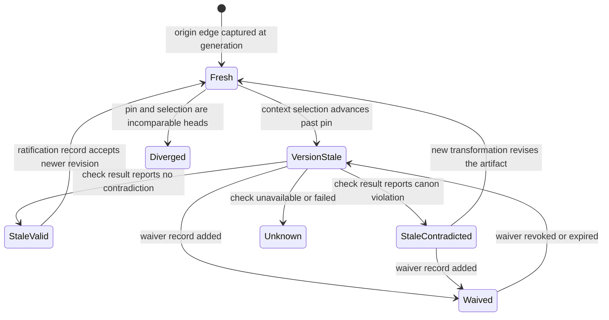
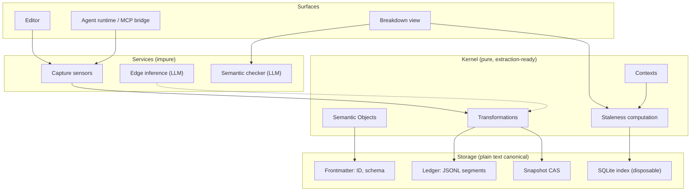

# Semantic Version Control for Recursively Developed Creative Work
## The VMark Coherence Layer — Design Paper

- **Version:** 1.1 (revised after cross-model review — see Appendix A)
- **Date:** 2026-07-18
- **Review:** Codex architecture review (thread `019f73e8-fb4b-7212-b4cf-5941a49de095`),
  verdict on v1.0: MAJOR GAPS. All blockers addressed in this revision;
  disposition table in Appendix A.
- **Status:** This paper **guides the implementation plan**, which is written
  after and traces to it (`dev-docs/plans/`, per `.claude/rules/60-ai-governance.md`).
  Requirements carry stable IDs (R1–R23), invariants I1–I4, open problems
  O1–O9, metrics M1–M5 — plan work items must reference these.
- **Evidence base:** three adversarially verified deep-research passes and the
  design-discussion record:
  - `dev-docs/deep-researches/20260718-canon-provenance-staleness-landscape.md`
  - `dev-docs/deep-researches/20260718-versioned-edges-staleness-prior-art.md`
  - `dev-docs/deep-researches/20260718-graphiti-agent-memory-academic-priorart.md`
  - `dev-docs/deep-researches/20260718-coherence-layer-conclusion.md`

---

## Abstract

Creative works are developed recursively: multiple co-constraining artifact
families (story chronology and narrative presentation; characters and scenes;
scripts and storyboards) evolve incrementally, each depending on versions of
the others. Existing tools fail structurally — git versions whole-tree content
without semantic identity, lint checks syntax not meaning, and knowledge tools
treat their contents as a settled base. Three verified research passes
establish that no product or research system combines: (a) an explicit canon
store, (b) versioned dependency edges with provenance, (c) staleness
propagation, and (d) LLM semantic consistency checking over natural language.
We propose a **coherence layer** for VMark built on a three-atom kernel —
Semantic Object, Transformation with recorded input set, Context — from which
edges, staleness, canon, and waivers are all derived rather than declared. The
design ports proven mechanisms (bi-temporal facts from Zep/Graphiti; resolver
indirection, automatic pin capture, and pull-based staleness surfacing from
the VFX pipeline stack; rebuilder/scheduler separability from build-system
theory) and contributes two constructs absent from every system the three
passes verified (residual unverified areas are named in §3.4):
**two-axis staleness** (stale-by-version-but-semantically-valid vs.
stale-and-contradicted) and the **dated, reasoned, human-ratified waiver**.
Truth lives in plain text; a per-workspace database is a disposable index; git
remains authoritative for content transport while the kernel is authoritative
for identity, edges, and meaning.

---

## 1. Introduction and Motivation

The founding pain is **recursive explosion**. A story's fabula (world
chronology) and syuzhet (narrative presentation) are developed in alternation,
neither upstream of the other; each increment in one can invalidate work in
the other. Add engines — characters, world rules, storyboards, generated
media — and cross-constraints grow roughly quadratically. LLMs amplify the
problem: generation became cheap, so the binding constraint moved from
*producing* artifacts to *keeping them coherent*.

Why current tools fail:

| Tool class | Structural failure |
|---|---|
| git | Versions whole-tree content snapshots. No persistent semantic identity (renames are heuristics), no dependency edges, no staleness. |
| Lint | Local syntactic invariants. Creative consistency is global and semantic. |
| Obsidian-class | Links are unversioned references, not dataflow. Knowledge modeled as settled, not co-evolving. |
| AI writing tools | Canon stores exist but consistency upkeep is manual (documented failure) or forward-only. |

The insight that makes the problem tractable now: **natural language is the
intermediate representation of LLM-era creative pipelines**. Text is the
coordination layer; images, video, and audio are build artifacts — cache
outputs of (text + model + parameters). Sources and recipes belong in plain
text; binaries belong in a content-addressed store.

## 2. Problem Formalization

The domain is **incremental computation over a cyclic, nondeterministic
dependency graph, with the human as scheduler**:

- **Cyclic:** co-constraining projections (fabula ↔ syuzhet) admit no
  topological order. Convergence is fixed-point-*seeking*, terminated by human
  judgment, not by a machine-detectable fixed point.
- **Nondeterministic:** LLM generation makes derivations non-replayable.
  A recipe is provenance, not reproducibility; chosen outputs are precious,
  unlike compiler caches.
- **Human-scheduled:** unlike `make`, nothing auto-rebuilds. Stale ≠
  rebuild-now. The tool's job is to make recursion *legible*, not to resolve
  it.

Two structural reductions:

1. **The explosion is invisible staleness.** Recursion is the creative
   process; what is unmanageable is holding in one's head which artifacts were
   written against which versions of which other artifacts. First-class,
   visible staleness turns anxiety into a work queue.
2. **A canon hub linearizes pairwise checking.** Engines check against a
   shared canon (established claims with provenance), not against each other:
   N checks instead of N².

## 3. Related Work and Evidence Base

All claims below were adversarially verified (3-vote panels) against primary
sources on 2026-07-18; details, votes, and refuted claims are in the three
research reports.

### 3.1 Capability matrix

Capabilities: (a) canon store, (b) versioned dependency edges with
provenance, (c) staleness propagation/visibility, (d) LLM semantic checking.

| System | (a) | (b) | (c) | (d) | Notes |
|---|---|---|---|---|---|
| Novarrium | ✅ locked | ❌ | ❌ | ⚠️ advertised | Forward-only enforcement; vendor-unverified |
| Novelcrafter | ✅ + per-item history | ❌ unversioned links | ❌ | ❌ | Revision history is backup, not dataflow |
| Sudowrite | ✅ | ❌ context wiring | ❌ | ❌ | Manual upkeep documented; top-voted request begs relief |
| ComfyUI | — | ⚠️ mechanical | ❌ | ❌ | Full recipe auto-embedded in every output binary |
| Google Flow / LTX Studio | ✅ visual | ❌ | ❌ | ❌ | Generation-time visual consistency only |
| OpenUSD / AYON / Flow Production Tracking | — | ✅ over binaries | ✅ version-number | ❌ | Resolver indirection; auto pin capture; pull-based breakdown; human-initiated updates |
| Zep/Graphiti | fact graph | ❌ no doc edges | temporal invalidation | ✅ contradiction detection | Fully automatic supersession; no human ratification |
| Ink & Switch Jacquard | — | ✅ within-project build provenance | ✅ rebuild detection | ❌ | Deterministic pipeline artifacts (data → analysis → figures), not NL semantic edges (verified 2026-07-18, WI-0.8) |
| Mem0 | fact store | ❌ | ❌ | LLM ADD/UPDATE/DELETE | Automatic; update-decision prompt no longer customizable |
| Academic (belief revision × LLMs) | — | — | named open problem | weights-level only | Consequence propagation "extremely difficult"; ~20% ripple accuracy |

### 3.2 The two complementary halves

- **The VFX stack has the version half, no semantics:** logical references
  resolved by pluggable resolvers (USD Ar — deliberately zero version
  semantics in core); automatic pin-file capture at publish (AYON); staleness
  as per-reference version comparison against a publish registry, surfaced in
  a dedicated pull-based breakdown view with strictly human-initiated updates
  (tk-multi-breakdown2).
- **Agent memory has the semantic half, no versions:** Graphiti's fact edges
  carry genuine bi-temporality (`created_at`/`expired_at` transaction time;
  `valid_at`/`invalid_at` event time), LLM contradiction detection, soft
  expiry with queryable history, and episode provenance — but supersession is
  fully automatic and there are no document-level dependency edges.

**No system joins the axes.** No system distinguishes "stale-by-version but
semantically still valid" from "stale-and-contradicted." No dated, reasoned,
human-ratified waiver exists anywhere surveyed.

### 3.3 Transferable laws (each grounded in a verified finding)

1. **Manually maintained dependency metadata dies** (Sudowrite's documented
   upkeep burden; no surveyed product even attempts manual edge declaration).
   Capture must be a zero-effort side effect of generation (ComfyUI, AYON).
2. **Registry beats filesystem** for "latest" (breakdown2's v1→v2 migration).
3. **Never trust author-editable metadata for provenance** (USD `assetInfo`'s
   documented failure).
4. **Staleness detection is separable from regeneration** (Build Systems à la
   Carte: rebuilder ⊥ scheduler) — staleness marking can ship standalone.
5. **Automatic semantic propagation is unsolved** (belief-revision
   literature) — which *validates* human-as-scheduler rather than undermining
   it: the design sidesteps the open problem instead of depending on it.

### 3.4 Known evidence gaps — resolved (2026-07-18, WI-0.8)

The gaps named in v1.1 were closed against primary sources on 2026-07-18:

- **DVC freeze/commit: confirmed metadata-free.** `frozen` is a plain
  boolean in `dvc.yaml`; `dvc commit` has no message/author/timestamp; the
  `desc`/`meta` fields are user-authored and explicitly ignored by DVC.
  No dated, reasoned, attributable divergence record exists — the waiver
  novelty claim stands.
- **Graphiti v0.27–v0.29 (Feb–Jun 2026): verified.** The bi-temporal
  fields predate the window; releases in the window refined
  `valid_at`/`invalid_at` processing (v0.29.0 split timestamp resolution
  into a dedicated step and fixed bulk-path `reference_time` propagation;
  v0.29.1 added episode-time watermarks). No human ratification and no
  document-level dependency edges shipped — the §3.1 row stands.
- **Ink & Switch: Jacquard has within-project cross-artifact provenance
  with staleness** (a build/provenance graph over data → analysis code →
  figures, with rebuild detection via a watcher) — the closest prior art
  in that corpus, now rowed in §3.1. It is deterministic build provenance
  over one project's computational pipeline, not versioned semantic edges
  between independently authored documents, and has no LLM checking and
  no waiver records. **Patchwork** is single-document version control
  (branching, history, diff); no cross-document features found (caveat:
  the Patchwork notebook is JS-rendered and was not directly extractable;
  the conclusion rests on the Universal Version Control essay and the
  Jacquard notebook's description of Patchwork).
- **ConStory-Bench: arXiv 2603.05890 is real** — "Lost in Stories:
  Consistency Bugs in Long Story Generation by LLMs" (2026-03-06), which
  *introduces* the ConStory-Bench benchmark; cite the paper title, not the
  benchmark name.

Letta's memory model remains unverified (its docs page changed under the
original pass) — not load-bearing for any design decision here.

## 4. Requirements

Plan work items must trace to these IDs.

### Capture and provenance

- **R1** — Every write to workspace state enters through a Transformation. No
  unprovenanced writes.
- **R2** — AI-generation Transformations record their exact input set
  (object @ revision for everything fed into the prompt/context).
- **R3** — Human-edit Transformations record the prior revision of the edited
  object exactly; *referenced* inputs may be inferred by LLM and lazily
  confirmed by the human.
- **R4** — No user-maintained dependency metadata exists anywhere in the
  system (zero-effort capture law).
- **R5** — Provenance is never stored in author-editable metadata.
  Frontmatter holds only author-owned facts: stable ID, schema/type, declared
  claims.

### Identity and history

- **R6** — Revision identity is content hash + parent links (a DAG). Sequential
  labels ("v4") are derived display names, never identity.
- **R7** — History is append-only; Transformations never mutate the past.
- **R8** — Split and merge of objects are Transformations recording identity
  lineage ("derived-from").
- **R9** — External edits (other tools, other agents) are reconciled by scan,
  synthesizing observed-external-edit Transformations (inputs unknown) so
  history stays gap-free.

### Staleness and resolution

- **R10** — The kernel computes *version staleness* deterministically and
  **Context-relatively** over the revision DAG: pinned = selected ⇒ fresh;
  pinned strict-ancestor-of selected ⇒ stale; incomparable ⇒ **diverged**
  (first-class state, surfaced, never guessed). "Latest" is always defined by
  a Context's selection, never globally.
- **R11** — *Semantic staleness* is a separate LLM layer classifying stale
  edges as **stale-but-valid** or **stale-contradicted** against claims
  visible in the artifact's Context.
- **R12** — Staleness resolution (ratify / update / waive) is performed only
  by a human or an explicitly delegated agent. Never automatic.
- **R13** — A waiver is a first-class, dated, reasoned, attributable
  **resolution record** (append-only, per I5) referencing the origin edge or
  violation it accepts; it never mutates the edge.
- **R14** — Only enforcing Contexts emit constraints; greenhouse (draft)
  Contexts never nag (staleness display is pull, not push, while drafting).
- **R15** — The breakdown view is pull-based, listing stale/diverged edges
  with per-item actions that are honest about what they create: **accept
  newer** (appends a ratification), **revise** (opens the artifact; a new
  transformation updates it), **waive** (appends a waiver). No action mutates
  provenance; automated content "update-to-latest" is regeneration and out of
  scope (§14).

### Storage and git interop

- **R16** — The per-workspace SQLite index is strictly derived: deleting it
  loses nothing; a rescan of plain-text tiers reproduces it fully.
- **R17** — Ledger entries are self-identified and order-independent (own ID,
  timestamps, causal references); appends go to per-writer segment files;
  `merge=union` covers residue.
- **R18** — Git *navigation* (checkout, branch switch, reset-style tree
  jumps) never mints revisions. `git revert` and merges are *mutations* —
  they create new content and are captured as transformations attributed to
  git. Detection is a **reconciliation problem with explicit operation
  classification**, not just `.git/HEAD` watching (the existing watcher
  ignores `.git`; worktrees use `.git` files; events can be missed) — it must
  handle worktrees, detached HEAD, and no-git workspaces, and it is a Phase 0
  go/no-go gate: unresolved failure here pollutes an append-only ledger
  permanently.
- **R19** — The kernel must not require git. Git blobs are opportunistic for
  snapshot content, never load-bearing (rebase/GC can prune them).
- **R20** — Binaries live in a content-addressed store outside git; a binary
  promoted to canon becomes a first-class object with provenance.

### Delivery

- **R21** — The on-disk format specification (ledger schema, pin manifests,
  frontmatter conventions, snapshot layout) is written and versioned before
  implementation. The format is the public contract.
- **R22** — The kernel is a pure, dependency-light, extraction-ready module;
  filesystem, watching, and LLM calls live in the service layer.
- **R23** — Kernel operations are exposed as MCP tools on VMark's existing
  server: **read-only surface (query staleness, list edges) from Phase 1**;
  mutating tools (ratify, waive) only under the authority model of R29.

### Precision requirements (added in v1.1 after cross-model review)

- **R24** — The **input-set taxonomy** is defined in the format spec with
  concrete examples: *direct* inputs (objects the output semantically depends
  on) create dependency edges; *contextual* inputs (assembled context not
  depended upon) are recorded as provenance without edges; *incidental*
  material (system scaffolding, boilerplate) is excluded.
- **R25** — Semantic-check results follow a versioned schema: labels at
  minimum {no-contradiction, contradiction, **unknown**}; unknown (provider
  unavailable, timeout, malformed output, low confidence) is first-class and
  never collapsed; results record model ID, prompt version, evidence spans,
  and timestamp; results are append-only assessments that expire when either
  endpoint advances.
- **R26** — Phase 0 produces a **write-path inventory** covering every path
  that mutates workspace state (editor autosave, AI-suggestion apply, MCP
  document tools, Tauri fs commands, terminal/external edits) and one atomic
  capture protocol with crash recovery; any path not yet instrumented is
  explicitly classified as observed-external — no silently uncaptured path.
- **R27** — The kernel is implemented **once, in Rust** (the backend owns
  filesystem truth); TypeScript consumes read models over IPC and implements
  no kernel semantics beyond display formatting.
- **R28** — Transformations and edges carry a **provenance-confidence** state
  (exact | inferred | unknown); UI and checker treat degraded provenance
  distinctly. "Gap-free history" (R9) means *no silent gaps*, not false
  precision.
- **R29** — Mutating kernel operations (ratify, waive, promote) require an
  authenticated actor identity and a recorded authorization; agent-performed
  resolution requires explicit per-workspace delegation and leaves audit
  records (refines R12).
- **R30** — Content hashing is canonicalized in the format spec: canonical
  byte form (encoding, line endings, Unicode normalization), hash algorithm,
  parent ordering in the revision DAG; reserved frontmatter identity fields
  are excluded from the content hash.
- **R31** — v1 object granularity is **file-level**; section-level objects
  are a later refinement gated on O9.
- **R32** — The format spec includes the **claim (canon fact) schema** with
  bi-temporal fields (event validity + transaction lifecycle, soft expiry,
  per the Graphiti-verified model) and provenance to the objects that
  established each claim.
- **R33** — Object/claim **maturity** (draft ↔ established) and Context
  **enforcement** (greenhouse ↔ enforcing) are distinct, explicitly related
  state machines; promotion is a transformation. Only established claims in
  enforcing contexts constrain (refines R14).

## 5. The Kernel Model

Three atoms. Everything else — character, theorem, scene, prompt, task,
claim, waiver, relation — is schema and transformations on top.

### 5.1 Atoms

**Semantic Object** — a persistent identity plus a revision history. Content
is stored as content-addressed snapshots (never operational deltas; prose
edits do not compose algebraically). Split/merge preserve lineage (R8).
Object *kind* is schema, userland. Rationale: persistent identity is
precisely what git lacks, and its absence is why git cannot host staleness or
provenance.

**Transformation** — an immutable event **with a recorded input set**:

```
{ inputs:  [(object @ revision), …],
  outputs: [(object @ new-revision), …],
  agent:   human | model(id) | external,
  intent:  prompt / params / instructions / edit-summary,
  time:    timestamp }
```

A provenance record, not a replayable function (nondeterminism). Dependency
edges are never declared; they are **observed**: "T produced scene-12@r
while reading elena@q" *is* the edge. This single design choice satisfies R2,
R4, and the transferable law that capture must be free.

**Context** — a scope of truth, deliberately narrow:

```
{ selections:   object → pinned revision | live,
  visibleClaims: set of claim-objects,
  canonStatus:  enforcing | greenhouse,
  parent?:      context }
```

The thing a document is opened *in*. Composition is single-inheritance
overlay only (child overrides parent) until a real vertical forces more —
deliberately resisting USD-scale composition algebra (O1). Branch = forked
context; variant = different selections; greenhouse = non-enforcing.

### 5.2 Derived constructs

| Derived | Derivation |
|---|---|
| Dependency edges | Transformation input sets |
| Version staleness | Pin comparison over the revision DAG (R10) |
| Semantic staleness | LLM layer over stale edges + visible claims (R11) |
| Canon | Claim-objects visible in an enforcing Context |
| Waiver | Schema'd object referencing an edge/violation + reason + date + author |
| Audit / provenance | The transformation log read backwards |
| Declarative relations ("Elena is Marcus's daughter") | Claim-objects (schema level) |
| Fabula / syuzhet | Two Contexts (or object families) over shared objects; cross-projection derivation edges observed automatically |

### 5.3 Invariants

- **I1** — Every write is a Transformation (= R1).
- **I2** — History is append-only (= R7).
- **I3** — The kernel computes staleness; only a human or explicitly delegated
  agent resolves it (= R12).
- **I4** — Constraints flow only from enforcing Contexts (= R14).
- **I5** — Origin provenance is immutable; resolutions (ratifications, waivers,
  check results) are append-only records; every displayed state is a
  projection over (origin edges, resolution records, viewing Context). Nothing
  ever mutates or deletes history.

### 5.4 Precedent check

The trio matches Datomic (entity / immutable transaction / database-as-value),
event sourcing + DDD (aggregate / event / bounded context), and USD (prim
identity / layer opinions / composition context) — while fixing git's identity
gap and adding what none of the precedents have: recorded input sets that make
semantic dependency edges observable, and a human-resolution invariant.

## 6. Two-Axis Staleness, Resolution Records, and Waivers (the contribution)

The verified gap: every prior system is either version-only (VFX/DVC) or
semantic-only (agent memory). The coherence layer joins the axes:

- **Axis 1 (kernel, deterministic, free):** relative to the viewing Context's
  selection, is the pinned upstream revision an ancestor of the selected one?
- **Axis 2 (LLM layer, judgment, on demand):** does the dependent artifact
  still hold against the claims visible in its Context?

### 6.1 Origin edges vs. resolution records (I5)

Two record kinds, never conflated:

- **Origin edge** — the historical fact that a transformation read A@v while
  producing B@w. **Immutable forever.** Nothing "re-pins" it; it is what
  happened.
- **Resolution record** — an append-only assessment about an origin edge:
  a *ratification* ("B@w is compatible with A@v′, accepted by ⟨actor⟩ on
  ⟨date⟩"), a *waiver* ("divergence accepted, reason, actor, date"), or a
  *check result* (§ R25). Later records supersede earlier ones without
  deleting them.

Every state below is a **projection** computed from (origin edge, resolution
records, viewing Context) — the state machine describes derived display
states, not mutations.

### 6.2 Edge state projection

Axis-1 comparison is Context-relative with DAG-ancestor semantics (R10):
pinned revision = selected revision ⇒ Fresh (or ratified-equivalent);
pinned is a strict ancestor of selected ⇒ VersionStale;
pinned and selected are incomparable heads ⇒ **Diverged** (a first-class
state — surface it, never guess).



### 6.3 Design notes

- Axis 2 runs only on demand (breakdown view, pre-export audit, explicit
  check) — never as a background nag (I4, R14). **Unknown** (provider down,
  timeout, malformed output, low confidence) is a first-class result, never
  collapsed into valid or contradicted (R25).
- Breakdown-view actions are honest about what they create (R15): **accept
  newer** appends a ratification record; **revise** opens the artifact so a
  *new transformation* updates it; **waive** appends a waiver. No action
  mutates an origin edge or any history (I5). Automated "update-to-latest" of
  prose content is regeneration and is out of scope (§14).
- The **waiver** makes intentional inconsistency a first-class creative tool
  (unreliable narrators exist): dated, reasoned, revocable, attributable, and
  displayed distinctly from unresolved staleness. Scope semantics (per-edge /
  per-object / per-claim; behavior when the upstream advances again) are O8,
  resolved in the semantic-model design phase.
- A pin is not a waiver (the VFX lesson): pins freeze resolution; waivers
  record a *decision about divergence* with authorship and rationale.

## 7. Storage Architecture

Three tiers; the database is never authoritative.

| Tier | Holds | Properties |
|---|---|---|
| Frontmatter (in the markdown file) | Author-owned facts: stable ID, schema/type, declared claims | Human-editable is correct here; minimal churn |
| Plain-text sidecar ledger (`.vmark/` in workspace) | Canonical provenance: append-only JSONL transformation segments, context pin manifests, waivers, content hashes | System-written, git-tracked, diffable; source of truth for edges |
| SQLite index (per workspace, gitignored) | Materialized edges, staleness cache, current-revision map, search | Disposable by invariant (R16) |

Why not frontmatter-only: provenance in author-editable metadata is the
`assetInfo` failure (R5); transformations are workspace-level multi-object
events belonging to no single file; per-generation frontmatter rewrites churn
content history; no query surface. Why not database-as-truth: forfeits
exactly the properties that made the pattern win — small, text, shareable,
versionable independently of any tool; SQLite is opaque to git, invisible to
other agents, tool-locked, and corruption would mean loss instead of rebuild.

Snapshot store: revision content is not derivable once a file moves on, so
the `.vmark/` content-addressed snapshot store is canonical for historical
text; git blobs are opportunistic (R19). Whether the snapshot store is
git-tracked is a per-workspace user choice.

## 8. Git Interoperability

**Division of authority:** git is authoritative for tree-level content
history and collaboration transport; the kernel is authoritative for
identity, edges, and meaning.

| Conflict surface | Resolution | Req |
|---|---|---|
| Git state-jumps change files without edits | Distinguish navigation from mutation; never mint revisions from navigation; a git branch maps naturally to a Context | R18 |
| Parallel branches mint colliding revisions | Revision identity is a hash+parent DAG; labels derived | R6 |
| Concurrent ledger appends conflict at EOF | Order-independent self-identified entries; per-writer segments; `merge=union` | R17 |
| History rewrite + GC dangle git-blob references | Self-contained snapshot store; blobs opportunistic | R19 |

The inverse case is the product working: git produces clean merges that are
semantically contradictory; a post-merge scan feeding the semantic layer
makes VMark the **semantic merge auditor git never had**.

## 9. System Architecture within VMark



Placement follows the three-tier source layout (ADR-013) and §7.9 of the
conclusion doc: **no separate engine project.** The kernel is a pure module
inside VMark (R22); the on-disk format is the public contract (R21); MCP is
the programmatic surface (R23). Capture asymmetry is accepted and explicit:
exact input sets for AI generations (the prompt context is known precisely);
heuristic, lazily confirmed inputs for human edits (R3). The first increment
is valuable on AI-generation edges alone.

**Kernel language (decided, R27):** the kernel is implemented once, in Rust —
filesystem truth, watching, ledger append, scanning, hashing, revision DAG,
staleness computation, SQLite, and CAS all live in the backend. TypeScript
consumes read models over Tauri IPC and implements no kernel semantics
(preventing the duplicate-semantics failure mode across the Rust/TS/sidecar
boundary). Exact module boundaries within the backend are plan-level
decisions. AI input capture (R2) is not free just because a prompt exists:
every real context-assembly path (Genie flows, MCP document tools, suggestion
apply) must be individually instrumented — this is part of the R26 inventory
and the Phase 0 capture gate.

## 10. Extensibility Model

Tiers 1–4 are the plugin system; tier 5 is deferred.

| Tier | Mechanism | Status |
|---|---|---|
| 1 | Schema packs (declarative object/claim/view definitions) | Kernel makes schemas userland; a vertical ships as data, not code |
| 2 | MCP servers (process-isolated tools) | Shipped both directions today |
| 3 | Formats as contract (ledger, manifests, IDs) | R21; third parties build against the format |
| 4 | Format adapters (new file types, custom views) | Registry exists; contributions as ordinary PRs |
| 5 | Runtime code plugins | Deferred: post-1.0, post-kernel-stability, demonstrated demand — then sandboxed (WASM / isolated webview, capability grants), never unsandboxed |

## 11. Open Problems

Re-sequenced after cross-model review: **O6, O7, and O9 are Phase 0
format/kernel decisions** (they shape the on-disk format and cannot be
retrofitted); **O1, O5, and O8 together form the semantic-model design phase**
that precedes Phase 2 implementation; O2 precedes Phase 3; O3 and O4 are
resolved during the phases they affect.

- **O1 — Context composition algebra.** Single-inheritance overlay is the
  deliberate floor; the first real vertical will pressure it. Composition
  rules are nearly impossible to retrofit (the USD LIVRPS lesson). Needs its
  own design session before Phase 2.
- **O2 — Human-edit input inference quality.** False edges are noise; missed
  edges are silent staleness. Deferred past v1 by design (R3), but the
  confirmation UX must be designed before Phase 3.
- **O3 — Snapshot store growth and retention.** GC policy for text snapshots
  and binary CAS; what "unreferenced" means when history is append-only.
- **O4 — Schema language.** Expressiveness vs. simplicity for object kinds,
  claim types, and views; versioning of schemas themselves.
- **O5 — Canon curation UX.** How claims get extracted from prose, promoted,
  scoped to contexts, and retired — without becoming homework (R4 applies to
  claims too).
- **O6 — Performance envelope.** Target workspace scale (files, revisions,
  edges) and staleness-query latency budgets; informs index design.
- **O7 — Multi-writer concurrency.** Two VMark windows / an agent and a human
  writing the same workspace simultaneously; per-writer segments (R17) are
  necessary but possibly not sufficient.
- **O8 — Waiver scope semantics.** Per-edge vs. per-object vs. per-claim
  waivers; expiry and re-prompt policy when the waived upstream changes again.
- **O9 — Revision granularity.** File-level vs. section-level objects for
  markdown; affects identity, capture, and noise in edges.

## 12. Evaluation Plan

The dogfood protocol precedes and accompanies implementation: one real
recursive creative project (multi-engine: story + characters + world + at
least one generated-media family) run inside VMark from Phase 1 onward.

| ID | Metric | Definition | Signal of failure |
|---|---|---|---|
| M1 | Capture coverage | % of AI generations whose transformations carry complete input sets | Any manual metadata entry observed (violates R4) |
| M2 | Staleness precision | % of flagged stale edges the human judges relevant | Flag fatigue; breakdown view ignored |
| M3 | Semantic-check precision | % of "contradicted" verdicts the human confirms | False contradictions erode trust fastest |
| M4 | Ratification burden | Resolutions demanded per working session | Tool feels like homework (adoption killer) |
| M5 | Time-to-confidence | Time from an upstream change to the human knowing its full blast radius | The founding pain, measured directly |

Qualitative gate: after the dogfood, the author should report that aggressive
upstream rewrites feel *safer* than before — "recurse without fear" is the
product; if M1–M5 are green but that sentence is false, the design missed.

## 13. Staged Delivery Outline (input to the plan — not the plan)

Per rule 60 §7 (spike before commit) and the rebuilder-before-scheduler
result, the plan should elaborate roughly (re-sequenced in v1.1):

- **Phase 0 — Format spec, kernel decisions, and go/no-go gates.**
  - Versioned format spec (R21), now explicitly including: input-set taxonomy
    (R24), hashing canonicalization (R30), claim schema with bi-temporal
    fields (R32), semantic-check result schema (R25), ledger segment/entry
    schema (R17), provenance-confidence states (R28).
  - Kernel decisions that shape the format and cannot be retrofitted: DAG
    head/ancestor semantics per Context (R10), file-level granularity (R31,
    O9), multi-writer protocol — writer identity, idempotency keys, atomic
    segment writes (O7, R17), performance targets (O6).
  - **Gate G1 — capture coverage:** write-path inventory (R26) plus an
    end-to-end capture prototype through editor, Genie, and MCP flows.
  - **Gate G2 — git operation classification:** navigation vs. mutation
    detection (R18) tested against checkout, reset, revert, merge, branch,
    worktree, detached-HEAD, and no-git workspaces. Failure here pollutes an
    append-only ledger permanently — go/no-go, not a soft spike.
  - Spikes: (S1) ledger merge behavior under real git branch/merge; (S2)
    SQLite (rusqlite) integration + index rebuild performance at target scale
    (O6); (S3) LLM edge-inference feasibility on real prose (O2 scoping);
    (S4) semantic-check precision against a seeded-contradiction corpus (M3
    baseline). Verify the §3.4 evidence gaps (DVC waiver metadata, Graphiti
    release window, Jacquard/Patchwork) — minutes each.
- **Phase 1 — Kernel + breakdown view.** Rust kernel (R27): revision DAG,
  ledger, snapshot CAS, SQLite index, capture for AI generations only,
  Context-relative version staleness incl. diverged (R10), pull-based
  breakdown view with accept-newer / revise / waive actions (R15),
  **read-only MCP surface** (R23). Ships standalone value.
- **Phase 2a — Semantic-model design phase (no UI).** O1 (context
  composition), O5 (canon curation lifecycle: extraction, promotion, scoping,
  retirement), O8 (waiver scope/expiry), maturity-vs-enforcement relation
  (R33) — designed together; they are one model.
- **Phase 2b — Semantic layer implementation.** Claim-objects, enforcing/
  greenhouse contexts, LLM semantic staleness with first-class unknown (R11,
  R25), waivers (R13), resolution records surfaced in the breakdown view.
- **Phase 3 — Human-edit inference + git-mapped contexts.** Inferred inputs
  with lazy confirmation (R3, O2, R28); branch-mapped contexts; post-merge
  semantic audit; mutating MCP tools under the R29 authority model.
- **Phase 4 — Verticals as schema packs + adapters.** First non-writing
  vertical (e.g., storyboard/media family) as schema pack + format adapter;
  MCP surface hardening.

Every phase gets machine-checkable DoD in the plan, not here — including
baselines and exit thresholds for M1–M5 (set at Phase 0, per review). TDD
applies throughout (`.claude/rules/10-tdd.md`); the kernel's single-language
purity (R22, R27) is what makes it cheaply testable.

## 14. Non-Goals

- No regeneration/orchestration engine (rebuilder before scheduler; jobs are
  a separate, later concern).
- No automatic semantic propagation (unsolved in the literature; the human is
  the scheduler by design, not by limitation).
- No standalone engine project, no runtime code-plugin API, no rebrand of
  VMark's identity.
- No cloud/collaboration layer; git remains the transport.
- No attempt to make LLM checking a blocking gate — it is advisory to a human,
  always (I3).

## 15. Next Steps and Governance

1. **Cross-model review of this paper** (Codex) — mandated by rule 60 §6 for
   work of this scope, and cheap insurance against single-model blind spots.
2. **O1 design session** (context composition) — before Phase 2 is planned in
   detail; Phase 0–1 can be planned immediately.
3. **Write the implementation plan** at `dev-docs/plans/YYYYMMDD-coherence-layer.md`:
   WI decomposition tracing to R/I/O/M IDs, ADRs, per-phase machine-checkable
   DoD (copy `scripts/check-gha-phase.sh` as template), dependency review for
   any new crates/packages.
4. **Dogfood workspace setup** — choose the real creative project that will
   exercise the layer from Phase 1.

## References

- Research reports (evidence, votes, refuted claims):
  `dev-docs/deep-researches/20260718-canon-provenance-staleness-landscape.md`;
  `…/20260718-versioned-edges-staleness-prior-art.md`;
  `…/20260718-graphiti-agent-memory-academic-priorart.md`;
  discussion record `…/20260718-coherence-layer-conclusion.md`.
- Zep/Graphiti: arXiv 2501.13956; github.com/getzep/graphiti; help.getzep.com.
- VFX stack: openusd.org (Ar 2.0 whitepaper, Ar API); NVIDIA Omniverse
  asset-structure principles; AYON USD resolver (help.ayon.app);
  tk-multi-breakdown / breakdown2 (developers.shotgridsoftware.com).
- Build-system theory: Mokhov, Mitchell, Peyton Jones, "Build Systems à la
  Carte," ICFP 2018.
- Belief revision × LLMs: Hase et al., TMLR 2024 (arXiv 2406.19354); ripple
  literature (arXiv 2410.03122, 2507.08427).
- Product landscape: novarrium.com; novelcrafter.com; docs.sudowrite.com;
  docs.comfy.org; Google Flow (blog.google); ltx.io; docs.mem0.ai
  (arXiv 2504.19413).

---

## Appendix A — Cross-Model Review Disposition (v1.0 → v1.1)

Codex architecture review, thread `019f73e8-fb4b-7212-b4cf-5941a49de095`,
read-only sandbox, high reasoning effort, five files (paper + four research
docs). **Verdict on v1.0: MAJOR GAPS** — direction buildable, sequencing
sound, precision insufficient to drive a plan. Reviewer's top risks:
(1) resolution actions contradicted immutable provenance; (2) DAG
"latest"/staleness semantics undefined; (3) reliable capture across VMark's
write paths harder than acknowledged.

Disposition of blockers (all accepted):

| Finding | Action in v1.1 |
|---|---|
| "Ratify/re-pin" mutates immutable provenance | §6.1 origin-edge vs. resolution-record split; I5; R13/R15 rewritten; states are projections |
| DAG staleness undefined with incomparable heads | R10 rewritten: Context-relative, ancestor semantics, first-class **Diverged** state |
| Write-capture model incomplete across VMark's paths | R26 write-path inventory + atomic capture protocol; Phase 0 Gate G1 |
| "Pure shared kernel" ambiguous across Rust/TS | R27: kernel implemented once in Rust; TS consumes read models over IPC |
| "Input set" undefined | R24 taxonomy (direct / contextual / incidental) in the format spec |
| O6–O9 sequenced too late for format-shaping decisions | §11/§13 re-sequenced: O6/O7/O9 → Phase 0; O1/O5/O8 → Phase 2a design phase |

High-severity findings accepted with paper changes: `git revert` reclassified
as mutation and git detection made a go/no-go reconciliation gate (R18, G2);
semantic-result schema with first-class unknown (R25); provenance-confidence
states (R28); MCP authority model + read-only-first (R23, R29); hashing
canonicalization (R30); file-level granularity decision (R31); bi-temporal
claim schema into the format spec (R32); maturity vs. enforcement separated
(R33); novelty claims softened (Abstract, §6); SQLite spike added (S2);
metric baselines/exit gates assigned to Phase 0.

Accepted but assigned to the plan rather than the paper: startup/shutdown/
crash recovery and malformed-ledger quarantine; CAS retention/integrity
policy; canon lifecycle detail (Phase 2a); multi-writer protocol detail
(Phase 0 decision); evaluation instrumentation.

Rejected: none. The review found no findings we assess as incorrect; two
were already partially covered (O7 multi-writer, O9 granularity) and were
promoted rather than newly added.
