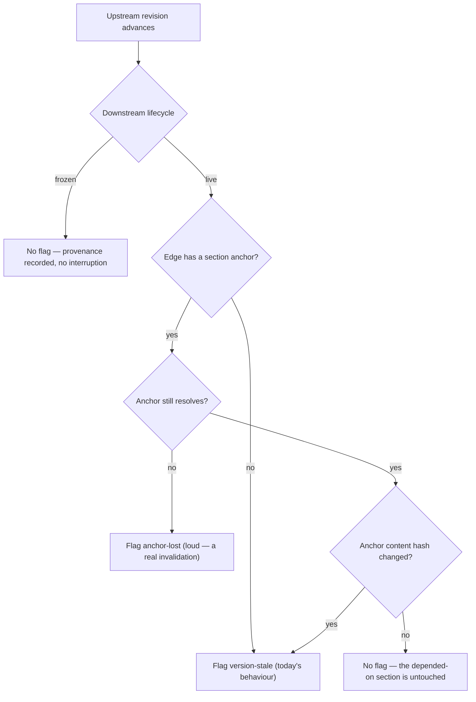

# Design — document lifecycle + section-anchored edges

> **Status: PROPOSED (2026-07-20).** Derived from the first live M-metric
> session, not from speculation. Both proposals exist to remove burden the
> session actually measured. No implementation yet; a plan follows if approved.

## The evidence that forced this

The 2026-07-20 dogfood session (`verify-at-volume-baseline.md`) measured, on a
real workspace:

| Reading | Value |
|---|---|
| M2 staleness relevance | **0 relevant / 5 noise** (owner-judged) |
| Edges reopened | **11 of 28**, several **4×** |
| M4 burden | 13/17/11 resolutions per session vs a ≤10 bar |

Two causes, both structural:

1. **No document-lifecycle model.** Every one of the 5 flags was noise for the
   same reason: the downstream document was *finished*. The layer interrupts
   about a completed plan exactly as loudly as about a living spec. A finished
   record cannot be invalidated by later upstream edits — it is a statement
   about what was true *then*.
2. **File-level granularity.** An edge pins `(upstream object, upstream
   revision)`, so *any* edit to a large upstream reopens *every* dependent edge —
   even when the passage the dependency actually rests on never changed. This is
   the plan's own R31 concern, now with a measurement behind it.

Together these explain the churn: the same edges were re-ratified up to 4×,
because unrelated edits to a big upstream kept reopening dependencies into
documents that were already done.

## Decision flow (both proposals together)

Note both "no flag" paths still **record the edge**. Nothing is deleted; only the
interruption is suppressed. That preserves the paper's *edges-are-inference,
not-homework* law — the provenance graph stays complete and queryable.

## A. Document lifecycle

**State:** an object is `live` (default) or `frozen`. `frozen` asserts "this
document is a finished record; later upstream changes do not invalidate it."

**Where it lives.** An append-only ledger entry, `object-lifecycle`
`{object, state, reason}` — latest wins, transitions stay in history. Rationale:
lifecycle is a *coherence-layer fact about an object*, and the ledger is the
truth for those. Frontmatter carries **identity** because the file must carry its
own identity across copies; lifecycle has no such requirement, and putting it in
frontmatter would make every freeze a content edit that mints a new revision —
which would itself restale dependents. That circularity is decisive.

**Who sets it.** The human, explicitly. **Not inferred.** Inference is tempting
(a plan whose Status header reads "complete") but it would make the layer
autonomously decide what to stop telling you — precisely the "human as scheduler,
no autonomous semantic propagation" stance the paper takes. A *suggestion* in the
UI ("this plan says complete — freeze it?") is acceptable; an automatic freeze is
not.

**Semantics.**

| Case | Behaviour |
|---|---|
| Downstream frozen | Suppress staleness flags for edges *into* it. |
| Downstream unfrozen later | Suppression lifts; staleness re-evaluates from current state. Resolution history is intact, so previously-ratified edges stay ratified. |
| Upstream frozen but edited anyway | **Flag loudly.** A frozen document changing is itself the anomaly — this is a new diagnostic, not silence. |
| Frozen doc in a canon/claim role | Unaffected. Claims are enforced independently of staleness. |

**What it does NOT do.** Freezing is not archiving, not read-only, not deletion.
The file stays editable; the layer just stops asking whether it is stale.

## B. Section-anchored edges

**Today:** `edge = (downstream, upstream, pinned_revision)`. Staleness =
`pinned_revision != current_revision`.

**Proposed:** an edge may additionally carry an **anchor** — the part of the
upstream the dependency actually rests on. Staleness then compares the *anchor's*
normalised content hash, not the whole file's revision.

**Anchor identity: heading path, not line range.** `["5. Resolution", "5.2
Waivers"]` survives edits above it; a line range does not. The anchored content
is the heading plus its body up to the next same-or-higher heading, normalised
with the existing canonical-text rules (CRLF, trailing whitespace, CJK spacing)
so cosmetic edits do not register.

**When the anchor cannot be found** (heading renamed or removed) → flag
`anchor-lost`, loudly. This is *not* a degradation to whole-file behaviour: a
vanished anchor is strong evidence the dependency genuinely broke, and silently
falling back would hide exactly the signal worth having.

**Capture burden — the main risk.** Anchors must not become mandatory homework.
Mitigation: **whole-file is the default**; anchors are an opt-in refinement.
The logbook already identifies which edges are expensive (`resolutions > 1`), so
the natural workflow is reactive:

> "This edge has reopened 4×. Anchor it to the section it depends on?"

Codex's concrete anchors for the measured edges: `R27` (architecture);
`O1/O5/O8/R33` (design-2a); the provenance-experiment paragraph (phase1-e2e);
`D1–D4` + the WI decomposition (the plan).

## Interaction, and which to build first

They are independent but compounding. On the measured corpus:

- **Lifecycle alone** removes all 5 noise flags (all downstreams were frozen).
- **Anchors alone** removes the *churn* on live documents — the 4× re-ratifications.

**Build lifecycle first.** It is far smaller (one entry kind, one predicate in
projection, one UI affordance), it needs no capture-time changes, and it
addresses 5/5 of what was actually measured. Anchors are a larger change to
capture, projection and UI, and their benefit is on live documents — which this
corpus had none of. Sequencing lifecycle first also means the anchor work can be
validated against a corpus that still has flags after lifecycle lands.

## How we would know it worked

Re-run the same measurement; these are falsifiable:

| Prediction | Fails if |
|---|---|
| Lifecycle: noise flags on frozen downstreams → **0** | any frozen downstream still flags |
| Lifecycle: reopened-edge count drops materially below 11/28 | churn is *not* concentrated on frozen docs |
| Anchors: edges anchored to untouched sections stop reopening | churn is driven by something other than granularity |
| M2 relevance rises on a **live** corpus | relevance was never a granularity/lifecycle problem |

The last one matters most and needs a **different corpus**: this repo's dev-docs
are overwhelmingly finished, so 0/5 partly reflects the corpus. A live writing
project is required before claiming either design improved relevance rather than
merely suppressed flags.

## Open questions — RESOLVED (owner: "ledger" + "use the right option")

1. **Suppress or downgrade? → COLLAPSED GROUP, not hidden.** `EdgeRow` carries
   `frozen_downstream` and the row stays in the breakdown. Hiding would let the
   layer silently ignore a dependency the owner later revives; flagging costs
   nothing and keeps it inspectable. Implemented.
2. **Freeze granularity → PER-OBJECT.** The owner described the concept as
   "frozen history" — a property of the *document*, not of individual
   dependencies. Per-edge freezing would multiply state and force reasoning about
   dependencies rather than documents. Where finer granularity is genuinely
   needed, **section anchors (§B) are the better instrument** than per-edge
   freezing: they answer "which part does this depend on?" instead of "mute this
   pair". Implemented per-object.
3. **Spec object model or projection-layer? → SPEC.** It is a durable ledger fact
   that changes what the layer asserts about an object, so it is specified as
   `object-lifecycle` in **coherence-format-v0.md §5.4.9**, including the
   forward-compatibility posture: a reader that does not know the kind preserves
   it and keeps flagging — an unexpected interruption, never a silent
   suppression. That asymmetry is deliberate; the dangerous failure is silence.
4. **Anchor extraction → MODEL-PROPOSED, HUMAN-CONFIRMED.** Never auto-applied.
   This matches the layer's existing stance everywhere else (the AI proposes, the
   human ratifies) and pairs naturally with the reactive workflow: the logbook
   already knows which edges are expensive (`resolutions > 1`), so the prompt is
   "this reopened 4× — anchor it to §X?" with the model suggesting §X. Applies to
   §B, not yet built.

## Not doing

- **Auto-freezing** by heuristic (see above — it is the autonomy line).
- **Deleting or archiving** frozen documents' edges. Provenance is permanent.
- **Line-range anchors.** Too brittle to survive ordinary editing.
