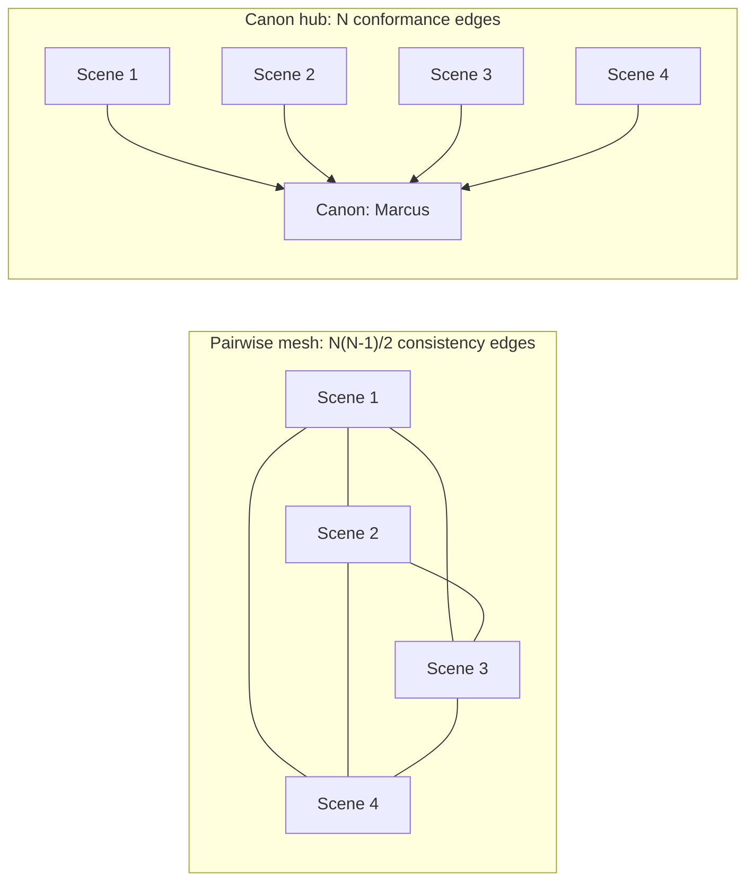

# State Ontology, Edge Taxonomy, and Staleness Architecture — Design Dialogue

> **Status: DESIGN DIALOGUE — captured discussion, not yet normative, not a
> plan.** This records a design conversation that *refines* `vision.md` and
> explores the staleness architecture underneath the coherence layer. Like
> `forward-operators-proposal.md`, it is design *input*: it must pass owner
> review + cross-model review (rule 60 §6) before any conclusion here becomes
> normative or seeds a plan (rule 60 §1). Where it seems to disagree with an
> APPROVED record (`design-2a.md`, `design-3.md`, the paper), those win for
> *what ships next*; this captures *direction and reasoning*.
>
> **Inputs:** `dev-docs/vision.md`, `coherence-layer-paper.md` (v1.1),
> `specs/coherence-format-v0.md` (rev 2), `forward-operators-proposal.md`
> (ADR-C6/C7), and the three `deep-researches/20260718-*` passes.

## 1. Vision refinement — "information-network state manager"

The one-sentence vision ("a general-purpose semantic-state runtime for
recursively developed knowledge work") has a tighter, more defensible
restatement:

> **A manager for the *state of an information network* — valuable to anyone
> who learns and creates.**

Why the restatement is stronger, not smaller:

- **It names the open slot exactly.** The three deep-research passes found that
  no shipping product manages *versioned dependency edges + staleness
  propagation*. Retrieval is not the moat (pre-built graphs lost that
  advantage); generation is not the moat; truth-checking is not even attempted.
  Managing the *state of the network* — the edges and their freshness — is the
  one durable capability. This sentence is its most precise form.
- **It is domain-neutral by construction.** A network of information does not
  care whether its nodes are scenes, hypotheses, lecture notes, or product
  specs. "Helps anyone who learns and creates" then follows *directly*, with no
  hand-waving.
- **It deliberately drops truth-verification.** The machine manages internal
  network state (what depends on what, what is stale). It does *not* claim
  correspondence-with-reality — that stays the human's or the source's job. A
  learner can hold a perfectly coherent but false model; the kernel maintains
  the coherence, not the correctness. Dropping this scope is what keeps the
  claim honest.

Two seams that keep the framing from over-reaching:

- **Value scales with interdependence, not volume.** A state-manager only pays
  off when nodes actually constrain each other — that is when staleness is a
  real event. Flat, disconnected learning (isolated facts) has no edges to rot,
  so the manager adds little there; recursive, co-constraining work is where it
  is transformative. This is why the paper's word *recursively* is load-bearing,
  not decorative.
- **The line inside the word "machine" (机).** The machine manages the
  *legibility* of state — it tracks edges, flags staleness, versions history,
  projects the network into any view. The human manages the *resolution* —
  deciding when a stale edge is updated, revised, or waived. The moment "manage"
  drifts toward "the machine reconciles the network for you," it walks into the
  ~20%-ripple autonomous-propagation failure the whole design refuses.

## 2. State ontology — history / derived state / projection

`vision.md` already fixes the core rule in one line: *"History is the ordered
log of those operations; current state is derived."* "State" is doing two jobs
until it is split into three layers:

| Layer | What it is | Mutability | Where it lives |
|---|---|---|---|
| **History** | Append-only ledger of transformations; every dependency ever created is recorded inside a transformation's input set (R24) | Immutable | The ledger (the truth) |
| **Derived state** | The current answer to "what exists, what depends on what, what is fresh," computed by projecting history onto the present | Recomputed, never stored | Disposable SQLite index (a cache) |
| **Projection** | Derived state rendered into a shape — graph, timeline, table, board | View-only | Frontend funnels |

**Where dependencies sit.** A dependency's *existence* is **history** (the
immutable input set — "Z was built from {A@v2, B@v5}"). A dependency's *status*
— fresh / stale / diverged / waived — is **derived state**, and it is
context-relative: the same edge is stale where A has advanced to v3 and fresh in
a context where A@v2 is still canon. The edge is stored **nowhere but the
ledger**; the graph and its staleness are recomputed on read.

Consequences that fall out of this:

- **No "set dependency" operation is needed or wanted.** Edges appear as a
  *consequence* of operations recording their inputs — the "edge inference is
  not homework" design law. The one exception is a *declared* dependency
  ("I assert these two are semantically linked," with no operation behind it) —
  that is authored data, closer to a schema-level *constraint* than a captured
  edge, and is the only kind of dependency that would be genuinely stored. The
  model biases hard toward captured over declared.
- **You manage state by appending to history, never by mutating the network in
  place.** This is the whole safety story: the machine cannot autonomously
  rewrite an edge because edges are not mutable objects at all.
- **State is disposable, so nothing is ever lost.** The dependency graph cannot
  be corrupted or "gone" — it was never the source of truth. Blow away the
  index and it rebuilds from the ledger. Local-first, no lock-in, git-like.

## 3. Edge / relationship taxonomy

**Dependency is one kind of relationship, and it is the load-bearing one.**

Inside the kernel as built there is only one *captured* structural edge —
**provenance** ("Z was produced from {A, B}"). "Dependency" is that same edge
*read forward*: provenance points backward ("made from"), dependency points
forward ("relies on — goes stale if A changes"). One recorded fact, two
directions. (The "forward operators" naming plays on exactly this duality.)

The property that makes dependency special is **propagation semantics** —
dependency is the relationship *over which staleness flows*. Not every
relationship does. The paper's headline "two-axis staleness" is really two
relationship kinds with two origins:

| Relationship | Origin | Shape | Staleness it carries |
|---|---|---|---|
| **Dependency** | *Captured* from provenance (input sets) | Directional | Version staleness (A advanced past the revision Z was built on) |
| **Contradiction** | *Discovered* by the semantic checker (R11/R25) | ~Symmetric | Semantic staleness (A now asserts something incompatible with Z) |

The two are ontologically different, not two labels on one thing: dependency is
captured and directional; contradiction is discovered-by-comparing-content and
roughly symmetric.

A long tail of relationships the kernel does **not** make first-class, precisely
because they do not (necessarily) carry staleness: **part-of / composition**,
**reference / mention**, **supersession** (this one *does* touch staleness),
**similarity / analogy**, **temporal / causal ordering**, **constraint**
(declared, schema-level).

**The real next question is not "more edge types."** It is a classifier:
*does this relationship carry staleness, and of which axis?* Adding part-of or
mention only earns its place if it changes what goes stale. Whether that
classifier is a kernel concern or a schema-pack (Tier-1) concern is open.

## 4. Staleness architecture

**Reframe the goal first.** "Keep each state free of staleness" is the wrong
target, and it hides the trap the project exists to avoid:

- The only way to make state *auto-fresh* is autonomous propagation — the exact
  thing the research says is unsolved (~20% ripple accuracy) and the guardrails
  refuse.
- Staleness is often *correct*: a draft you have not yet updated *should* read as
  stale.

So the enemy is not staleness — it is **invisible staleness**. The achievable,
correct goal is three guarantees:

1. **No hidden staleness** — every stale edge is detected and visible.
2. **Bounded blast radius** — the true, transitive extent is always known.
3. **Cheap re-coherence** — resolving it is one legible action, not archaeology.

### The architecture, in layers

| Layer | Strategy | Professional lineage |
|---|---|---|
| **Detect everything** | Capture must be *total and inescapable* — the editor is the mandatory sensor; any un-captured write is a hole where staleness hides. Plus a **reconciliation scan** for out-of-band changes (git merges, external edits) marking unknown provenance `Diverged`. | Hermetic build inputs (Bazel/Nix): an undeclared input = a wrong graph. |
| **Derive, never store** | Staleness is a **pure function** `stale(edge, context) = f(origin, current revisions, resolutions, context)`, recomputed on read. The SQLite index is a *disposable cache* (S2: 6.4ms reads), always rebuildable from the ledger (S2: 1.34s). Correctness lives in the pull model; speed in the index; "index is disposable" reconciles them. | Git working-tree status (computed, not stored); incremental computation (Salsa). |
| **Propagate correctly** | Staleness is a **transitive closure over the dependency DAG**, computed **relative to a context**. Advancing A flags Z *and* Y-downstream-of-Z. Waivers decide whether propagation *stops* or *passes through* (see §5). | VFX breakdown apps (Flow Production Tracking): which downstream shots need re-render. |
| **Two detectors, two cadences** | **Version axis** = synchronous, deterministic, cheap → real-time exact. **Semantic axis** = async, probabilistic (~89%), expensive → background job over the *blast radius only*, results appended as advisory check-results, with a visible "checking…" pending state. | Fast/exact vs. slow/approximate split in any pipeline. |
| **Optimize the human's move** | Since you cannot auto-fix, make resolution cheap: a **breakdown view** ranks everything stale in a context; each edge shows *what changed and what it affects*; resolution is one action — accept-newer / revise / **waive** (R15). | VFX artist breakdown: update each stale reference in one click. |

### The one honest asymmetry

The two axes give *different guarantees*, and conflating them is where
overclaiming starts:

- **Version staleness — a hard no-hidden-staleness guarantee.** Deterministic
  and cheap; if capture is total, detection is total.
- **Semantic staleness — no such guarantee.** The LLM checker lags (cannot run
  per keystroke) and misses (~89% precision). Best achievable is *bounded lag +
  visible pending-state + recall improving over time*. Anyone promising "free of
  semantic staleness" is lying to themselves. Today the semantic leg is
  unproven at volume — the ledger holds only 3 check-results, Phase 2b
  unfinished — so the version leg is architecturally solid, the semantic leg is
  right-in-shape but not yet load-tested.

### Reduce generation, not just detection (the highest-leverage moves)

- **Canon-hub topology.** N objects depending pairwise = N(N−1)/2 edges to keep
  fresh; routing dependencies through a designated **canon** per concept
  collapses it toward N. Fewer edges → smaller staleness surface → cheaper
  coherence. Deep-dive in §6.
- **Object granularity.** Too coarse (object = whole document) → every edit
  stales every dependency → alert fatigue → the human stops looking → hidden
  staleness returns through a desensitized reader. Too fine → capture overhead.
  Granularity is the knob that controls false-positive staleness, and getting it
  wrong destroys the trustworthiness of the signal — the real asset.

### The metric that says it is working

Not "staleness count = 0" (that number should never be zero on a living
workspace) but the **re-coherence tax trending down** over a workspace's life
(the drift gauge, `epcho-ai/instruments/drift_metrics.py`). Coherence that
*compounds*, not staleness that is *absent*.

---

## 5. Deep-dive A — waivers and propagation (stop vs pass-through)

Setup: `A → Z → Y` (Y depends on Z, Z depends on A). A advances to v3; Z was
built from A@v2, so Z is stale. The human **waives** Z's staleness ("Z is fine
as-is"). Does staleness pass through to Y?

**The dichotomy mostly dissolves under correct local semantics.** Version
staleness is *strictly local to the immediate edge*: **Y is stale iff Z's
current revision differs from the revision Y was built on.** A's movement never
reaches Y directly — only *through Z advancing*. So the three resolution
actions (R15) have clean, distinct propagation consequences, and no special
pass-through rule is needed:

| Action on Z | Does Z advance? | Effect on downstream Y |
|---|---|---|
| **accept-newer** (adopt A@v3) | Yes | Y stales — correct, Z genuinely changed |
| **revise** (edit Z to reconcile) | Yes | Y stales — correct |
| **waive** (accept Z as-is) | **No** | Y stays fresh — *automatically* |

So **waive is exactly the action that stops propagation, and it does so
correctly and for free** — because it is the action that does not advance the
node, and downstream version-staleness fires only on advancement. "Stop vs
pass-through" is not a rule to choose; it falls out of "does the node move?"

**The genuinely load-bearing decision is waiver scope and expiry.** A waiver is
not "ignore this edge forever" — that is the alert-fatigue-through-the-back-door
failure (a permanently-waived edge is *invisible* staleness wearing a hat). A
waiver must **pin the exact upstream revision it accepts** and **auto-expire
when the upstream advances again**:

- Waive Z accepting **A@v3**. If A later moves to v4, the waiver no longer
  covers the new delta → Z **re-stales**. The human re-decides.
- Concretely: `waiver = (edge, upstream_revision_accepted, context, rationale,
  timestamp)`; a live check compares `upstream_revision_accepted` against the
  upstream's *current* revision and revives the staleness on mismatch.

**Waived ≠ invisible.** A waived edge stays in the breakdown, *muted*, labelled
"accepted vs A@v3" — accepted, not gone. This is the concrete realization of the
distinction the deep-research said no system draws: **stale-and-contradicted vs
stale-but-accepted.** The waiver is the object that makes "stale-but-accepted" a
first-class, visible, revisitable state.

**Two secondary tensions to decide later:**

- **Downstream-edit invalidation.** If Z is edited for an *unrelated* reason
  (Z advances), is its waiver-vs-A still valid? Z's content changed, so the
  acceptance arguably should be re-evaluated — but re-nagging on every unrelated
  edit is annoying. Leaning: a waiver survives downstream edits but is *flagged
  for review* when the waived object itself changes materially.
- **The semantic axis has nothing to "stop."** Semantic staleness
  (contradiction) is *discovered per-edge by content comparison*, re-run when an
  endpoint changes — it does not propagate transitively along the DAG. A waiver
  on a contradiction is a **check-result annotation** ("this contradiction is
  accepted"), version-scoped exactly like the version waiver; it cannot and does
  not pre-empt a future Y-vs-Z check.

**Everything here rests on capture completeness.** Propagation is correct only if
edges exist where dependencies *truly* are. A complaint that "waiving Z should
have flagged Y" is almost always a **missing Y→A edge** (Y really did depend on A
directly), not a propagation-rule bug. The fix lives in the capture layer (§4),
not in the waiver rule.

## 6. Deep-dive B — canon-hub topology

**The problem it attacks.** In recursively developed work, objects
co-constrain. Naive *conformance* consistency is all-pairs: N objects that must
stay mutually consistent imply up to **N(N−1)/2** consistency relationships,
each an edge that can go stale — a **superlinear** staleness surface as N grows.
This is the "recursive explosion."

**The move.** Introduce a **canon** node per concept — a designated
source-of-truth object holding the authoritative statement of that concept.
Every conformer points at the canon instead of at each other. The mesh becomes a
star.

**The honest version of the N² → N claim.** Real work is not a fully-connected
mesh, so it is not literally N² edges. The precise claim is: *conformance
consistency is inherently all-pairs among conformers, and the hub factors that
shared constraint into one node* — converting "keep every pair mutually
consistent" (superlinear) into "keep each conformer consistent with one canon"
(linear). **Canon converts a superlinear coherence cost into a linear one for
the conformance subclass of dependency.** This is the single biggest lever on
re-coherence tax.

**What canon buys:**

- **Edge count N(N−1)/2 → N.** Quadratic → linear staleness surface.
- **Single point of update, enumerable blast radius.** Change the concept once
  (edit the canon); exactly the N dependents stale — explicit, not diffuse.
- **Coherence becomes a *checkable predicate*.** "Is the work coherent w.r.t.
  Marcus?" = "does every dependent conform to canon(Marcus)@current?" In a mesh,
  coherence is a global pairwise property that is far harder to state or check.
- **Clean anchor for versions and waivers.** `canon(Marcus)@v3` is a real
  version anchor; "scene accepted vs canon@v2" is exactly the waiver-scoping of
  Deep-dive A.

**What canon costs / where it does *not* apply:**

- **Canon is for *conformance*, not *ordering*.** It works for
  conform-to-a-truth relationships (character facts, world rules, definitions).
  It does **not** replace *sequential / relational* dependencies (scene-3 follows
  scene-2 in time; cause → effect). Those stay pairwise/directional. Canon is a
  tool for one subclass of dependency, not all of them.
- **God-object risk = the granularity lever, re-applied at the hub.** If
  `canon(Marcus)` accretes every fact, editing it stales everything constantly.
  Fix: fine-grained canon — `canon(Marcus.appearance)`,
  `canon(Marcus.allegiance)` — so an allegiance change does not stale scenes that
  only depend on appearance. Canon-hub (topology) and object granularity (§4)
  are the *same lever* applied at the hub.
- **Canon-of-canon layering.** Canons depend on canons (world-rules →
  guild-law → Marcus.allegiance), so the hub is a *DAG of canons* with leaf
  objects at the fringe. Staleness flows down the canon DAG then out to leaves —
  still vastly better than mesh, but canon design is itself a modeling activity.

**Design recommendation (no new kernel atom):**

- A canon is an **ordinary semantic object** flagged (schema / frontmatter) as
  *authoritative for concept X in context C* — consistent with paper §5
  (everything is objects + transformations). Context-relative by construction:
  an alternate-timeline context can hold a `Diverged` `canon(Marcus)`.
- The canon-hub dependency type is a **conformance edge** (object → canon@rev),
  captured when the object references/uses the canon (edge inference, not
  homework).
- **Canon-ization is incremental and *proposed*, never forced.** When a concept
  is referenced by ≥k objects with pairwise-drift risk, the system *proposes*
  extracting a canon — a natural, concrete **forward operator** (ADR-C6):
  **Extract-Canon** as a named operation with propose → preview-blast-radius →
  human-accept. This is one of the strongest motivating use-cases for forward
  operators.

**Prior art it echoes:** database normalization (one fact, one place; foreign
keys point at it), USD composition/reference (assets referenced, not copied),
and the VFX publish → pin pattern (a shot pins the published asset *version* —
conformance-to-canon-version by another name).

---

## Open threads (for owner + cross-model review)

1. Whether the relationship classifier of §3 ("does this edge carry staleness,
   and which axis?") is a kernel concern or a Tier-1 schema-pack concern.
2. Waiver downstream-edit invalidation policy (§5) — survive-but-flag vs revoke.
3. `Extract-Canon` as the first named forward operator (§6 + ADR-C6), pending
   the Phase-2b checker producing signal at volume.
4. Object/canon granularity defaults — the knob that governs false-positive
   staleness and thus the trustworthiness of the whole signal.
