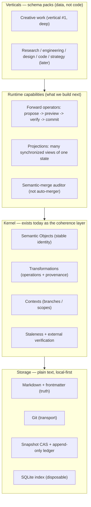

# VMark as a Semantic-State Runtime — North Star

> **Role:** This is the destination that the coherence-layer paper, plan, and
> proposals *serve*. The paper (`coherence-layer-paper.md`) scopes the first
> deliverable narrowly and correctly; this document names the larger arc that
> first deliverable is the kernel of. Where the two ever seem to disagree, the
> paper's engineering discipline wins for *what ships next*; this document wins
> for *where we are going*.
>
> It is not a rebrand and not a standalone engine project (paper §14): the same
> VMark, the same in-product kernel (R22), a bigger destination.

## The vision in one sentence

VMark becomes a **general-purpose semantic-state runtime** for recursively
developed knowledge work — a workspace where knowledge lives as **evolving
semantic objects transformed by named operations**, every change is
**verified and versioned**, and one underlying state can be **projected into
any view** — with recursive creative work as the first vertical and every
other domain arriving later as a schema pack on the same kernel.

## Why now

Generation became cheap. The binding constraint moved from *producing*
artifacts to *keeping them coherent as they co-evolve*. That is true for a
novel's characters and scenes, a research program's hypotheses and results, a
codebase's modules, a product's specs and designs. The common structure is the
same: **many co-constraining objects, each developed against versions of the
others, with a human deciding when the whole is coherent enough.** No existing
tool treats that structure as first-class — git versions text without meaning,
lint checks syntax not meaning, note tools treat knowledge as settled. VMark
already chose the right substrate (plain text, local-first, AI and human on the
same artifacts). The coherence layer adds the missing kernel: identity, typed
operations, provenance, versioned dependency, and verification. That kernel
generalizes.

## The core model

Everything reduces to one loop over semantic objects:

**State → Operator → (verify) → State → Project.**

- The **atom** is a *semantic object* — a stable identity plus a revision
  history — not a document and not a bare graph node.
- **Change** happens through *named operations* (Split-Character, Generalize,
  Relax-Constraint, Extract-Function), recorded with their exact input set.
- **History** is the ordered log of those operations; current state is derived.
- **Verification** is external: a *proposed operation* is a proposal until a
  human (or an explicitly delegated agent) accepts it, and the semantic check
  **informs** that acceptance — advisory, never blocking. Direct and external
  edits are captured after the fact, not gated.
- **Visualization is decoupled from state** — a graph is one projection among
  many (timeline, table, board, storyboard, map), with no privileged status.

These are not aspirations; the three kernel atoms already exist in the
coherence layer: **Semantic Object, Transformation (operation + provenance),
Context (branch / scope).**

## The architecture of the arc

Read it top-down: verticals ship as *data* (schema packs) on a runtime built
from a kernel that already exists, over storage that is plain text a human can
read in any editor. Generality is the **top** layer, reached last — not the
foundation.

## The evidence this rests on

The shape above is not a preference; it is what the research forces (three
adversarially verified passes here, plus the research track in the sibling
`epcho-ai` repo). The load-bearing findings:

| Finding | Consequence for the build |
|---|---|
| Pre-built knowledge graphs lost their **general retrieval** advantage; on-demand structuring ties them | **Do not build for retrieval.** Retrieval is not the moat. |
| The one structure-specific advantage over prose+git is the **operation-level semantic diff** | The **semantic operation** is the atom of both storage and review. |
| **Verification is the binding constraint**, and LLM self-correction does not catch its own errors | Verification is **external and first-class**: propose → verify → commit. |
| **Automatic semantic propagation is unsolved** (~20% ripple accuracy) | The **human is the scheduler**, by design — not by limitation. |

## Non-negotiable guardrails

The grand destination is reached *only* by holding these. They are what keep
ambition from becoming the failure modes the research documented:

1. **Human-as-scheduler.** The AI *proposes* operations and makes their blast
   radius legible. It never autonomously searches a state space and commits a
   winner. Evaluation is human acceptance plus advisory (never blocking)
   checks.
2. **Verification is external and first-class.** Never trust a model to grade
   its own output; never make the check a blocking gate — it is advisory to a
   human, always.
3. **Truth lives in plain text.** Markdown + frontmatter is authoritative; git
   is transport; the database is a disposable index; large media are
   content-addressed. Local-first, no cloud, no lock-in.
4. **Generality is earned, not declared.** One vertical (creative work) proven
   deeply first; every other domain arrives as a schema pack with its own
   evidence. We never ship a general framework that does nothing in particular.
5. **The semantic operation is the unit of storage and of review.** A reviewer
   accepts "add claim X, sourced Y, on object Z" — a typed operation — not a
   text blob and not the model's self-assessment.

## What we build — the arc, staged

Each stage names what already exists so effort lands on the frontier, not on
re-plumbing.

| Stage | Build | Status in VMark |
|---|---|---|
| **1. Kernel + semantic layer** | Objects, Transformations, Contexts, version staleness, the LLM semantic checker | Kernel shipped (Phase 1); semantic layer in progress (Phase 2b) |
| **2. Forward operators** | Named operations that propose a changeset, preview its blast radius, verify, and commit only on human accept | Proposed (ADR-C6, `grills/coherence/forward-operators-proposal.md`) |
| **3. Semantic-merge auditor** | After a git merge, check affected edges and surface contradictions for human resolution — *audit, never auto-merge* | Proposed (ADR-C7, same doc) |
| **4. Projection framework** | One abstraction for "many synchronized views of one state," unifying the format registry and the coherence panels | Partial (per-type views + bespoke panels exist) |
| **5. Verticals as schema packs** | Creative work fully; then a second domain — how generality actually arrives | Extensibility Tier 1 defined (paper §10) |
| **6. Earned ecosystem** | Schema packs, MCP tools, format adapters as the contract | Tiers 1–4 open; runtime code plugins deferred (Tier 5) |

The immediate frontier is **stage 1 → 2**: finish the Phase 2b checker so
verification produces signal at volume, then add forward operators. Everything
downstream depends on the verify step working.

## What we deliberately refuse

- **No autonomous exploration / auto-propagation.** The literature says it does
  not work; the human schedules.
- **No premature generality.** No multi-domain claims before one vertical is
  proven with evidence.
- **No runtime code-plugin platform** before the kernel is stable and demand is
  demonstrated (Tier 5 deferred).
- **No regeneration/orchestration engine**, and **no blocking LLM gate**.
- **No database-as-truth, no cloud, no lock-in.**

## How we will know it is working

- The kernel's own dogfood metrics (paper §12: capture coverage, staleness
  precision, semantic-check precision, resolution burden, time-to-confidence).
- The **drift gauge** (`epcho-ai/instruments/drift_metrics.py`): does verified
  quality *compound* or *drift* as a workspace evolves over time? This is the
  open question no prior system answered; our ledger is where it gets answered.
- The qualitative gate: aggressive upstream rewrites feel **safer** than before
  — "recurse without fear."
- The far milestone — the real test: **the system manages its own evolution.**
  When VMark's own recursive work (this repo's design, its docs, its plans) is
  coherently maintained by the kernel rather than held in a human's head, the
  architecture has proven it is not just elegant but operationally viable.

## Where this lives relative to the rest

- `coherence-layer-paper.md` — the kernel's rigorous design (the *how*).
- `grills/coherence/forward-operators-proposal.md` — the next runtime layer
  (proposed).
- The `epcho-ai` repo — the research and evidence track: the deep-research
  reports and the drift instrument that keep this vision honest.

This document is the *why* and the *where to*. The others are how we get there,
one verified step at a time.
