# Mermaid Diagrams

VMark supports [Mermaid](https://mermaid.js.org/) diagrams for creating flowcharts, sequence diagrams, and other visualizations directly in your Markdown documents.


## Inserting a Diagram

### Using Keyboard Shortcut

Type a fenced code block with the `mermaid` language identifier:

````markdown
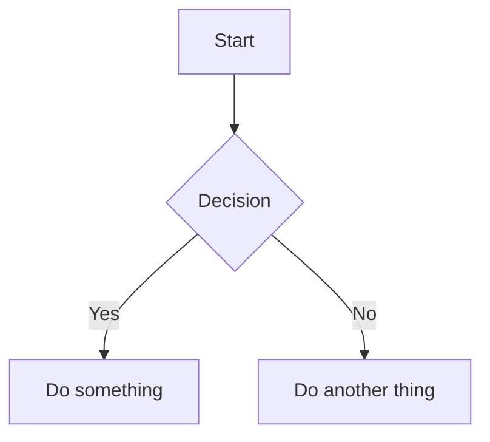
````

### Using Slash Command

1. Type `/` to open the command menu
2. Select **Mermaid Diagram**
3. A template diagram is inserted for you to edit

## Editing Modes

### Rich Text Mode (WYSIWYG)

In WYSIWYG mode, Mermaid diagrams are rendered inline as you type. Click on a diagram to edit its source code.

### Source Mode with Live Preview

In Source mode, a floating preview panel appears when your cursor is inside a mermaid code block:


| Feature | Description |
|---------|-------------|
| **Live Preview** | See rendered diagram as you type (200ms debounce) |
| **Drag to Move** | Drag the header to reposition the preview |
| **Resize** | Drag any edge or corner to resize |
| **Zoom** | Use `−` and `+` buttons (10% to 300%) |

The preview panel remembers its position if you move it, making it easy to arrange your workspace.

## Supported Diagram Types

VMark supports all Mermaid diagram types:

### Flowchart

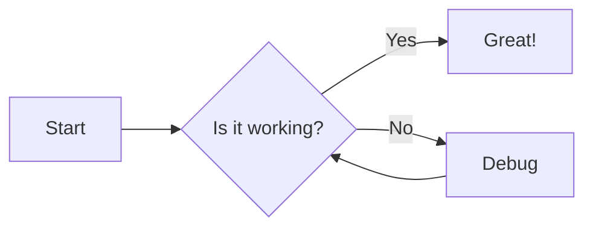

````markdown

````

### Sequence Diagram

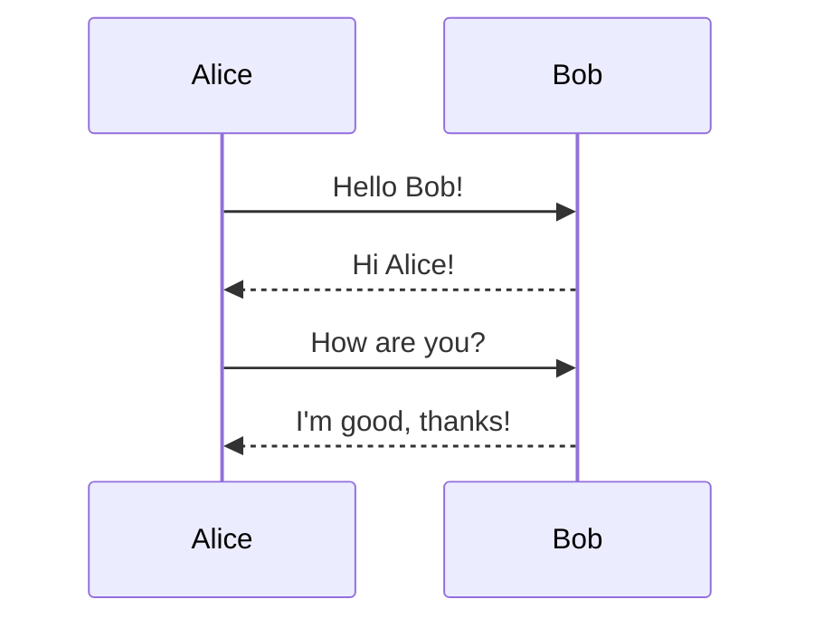

````markdown
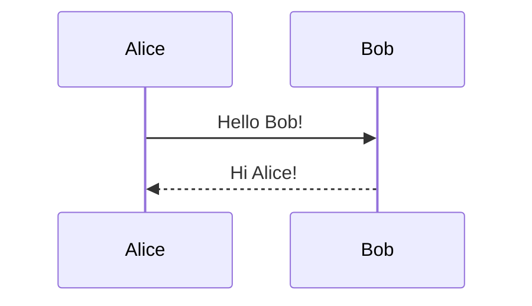
````

### Class Diagram

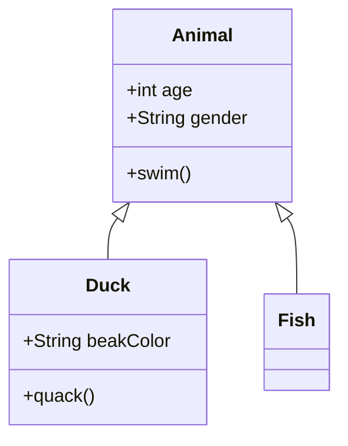

````markdown
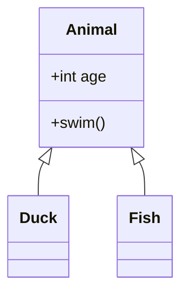
````

### State Diagram

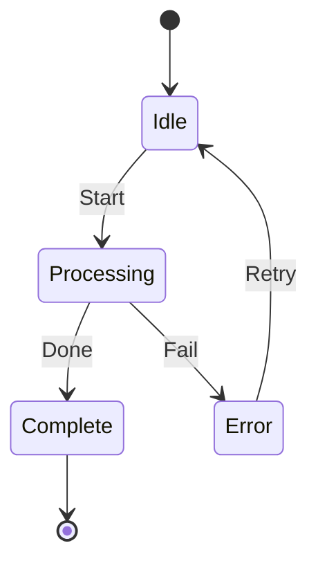

````markdown
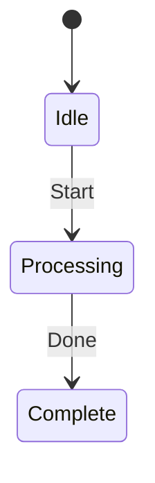
````

### Entity Relationship Diagram

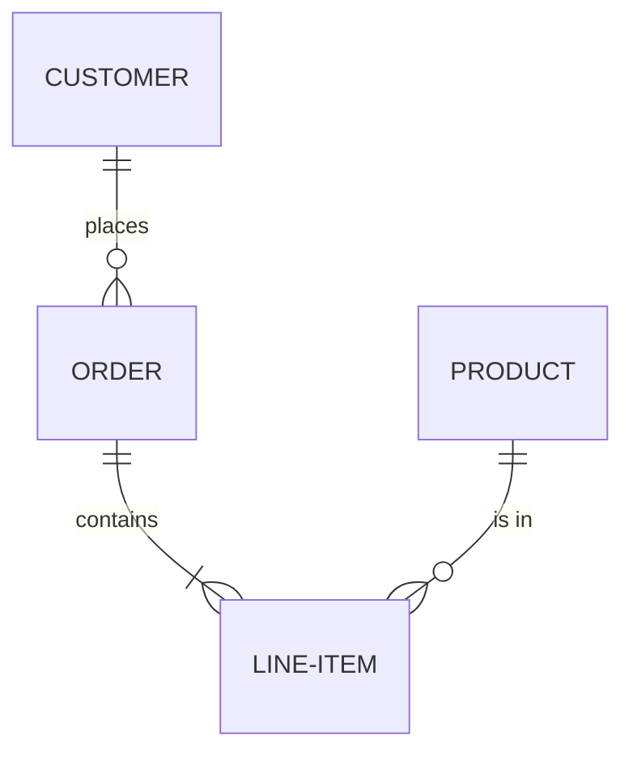

````markdown
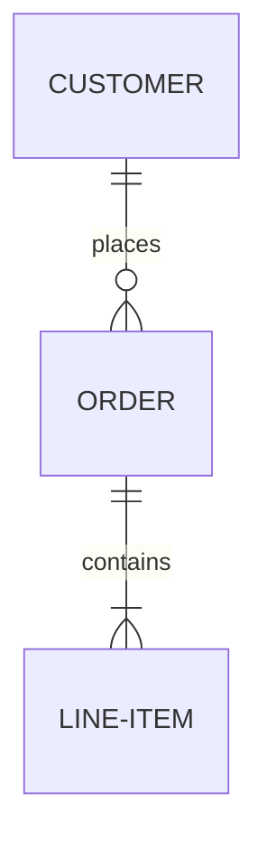
````

### Gantt Chart

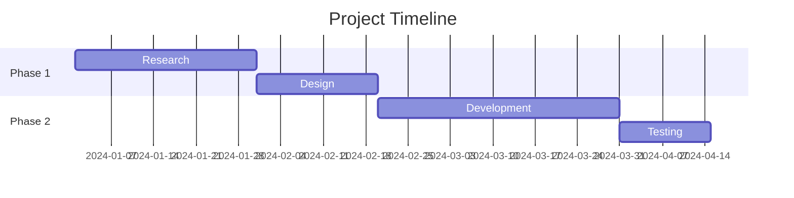

````markdown
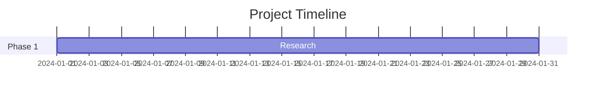
````

### Pie Chart

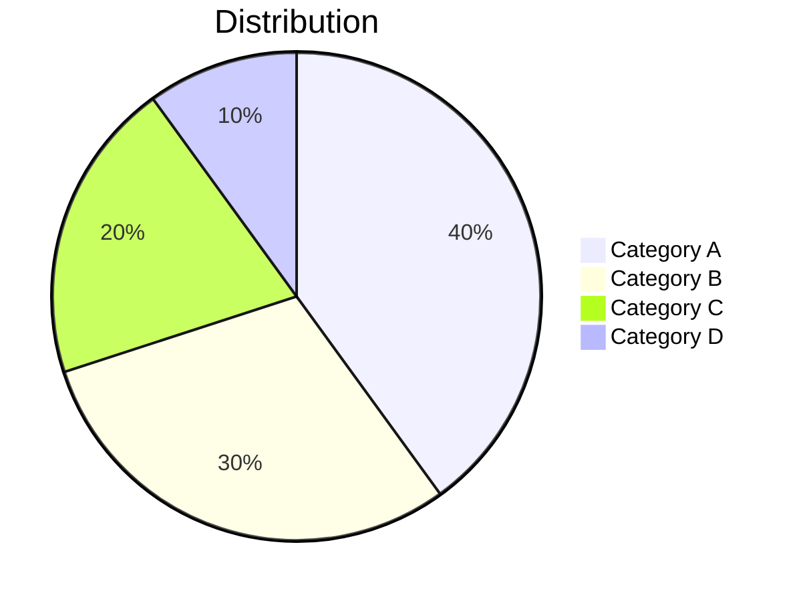

````markdown
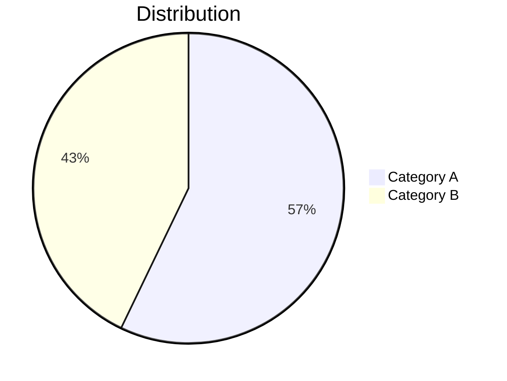
````

### Git Graph

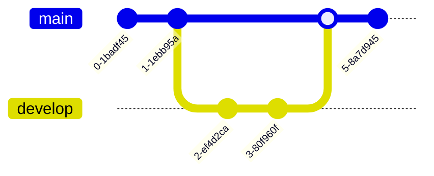

````markdown
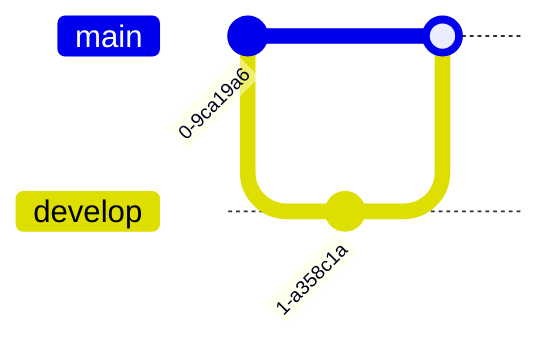
````

## Tips

### Syntax Errors

If your diagram has a syntax error:
- In WYSIWYG mode: the code block shows the raw source
- In Source mode: the preview shows "Invalid mermaid syntax"

Check the [Mermaid documentation](https://mermaid.js.org/intro/) for correct syntax.

### Theme Integration

Mermaid diagrams automatically adapt to VMark's current theme (light or dark mode).

### Export

When exporting to HTML or PDF, Mermaid diagrams are rendered as SVG images for crisp display at any resolution.

## Learn More

- [Mermaid Official Documentation](https://mermaid.js.org/)
- [Mermaid Live Editor](https://mermaid.live/) - Test diagrams online
- [Mermaid Cheat Sheet](https://mermaid.js.org/syntax/flowchart.html)
